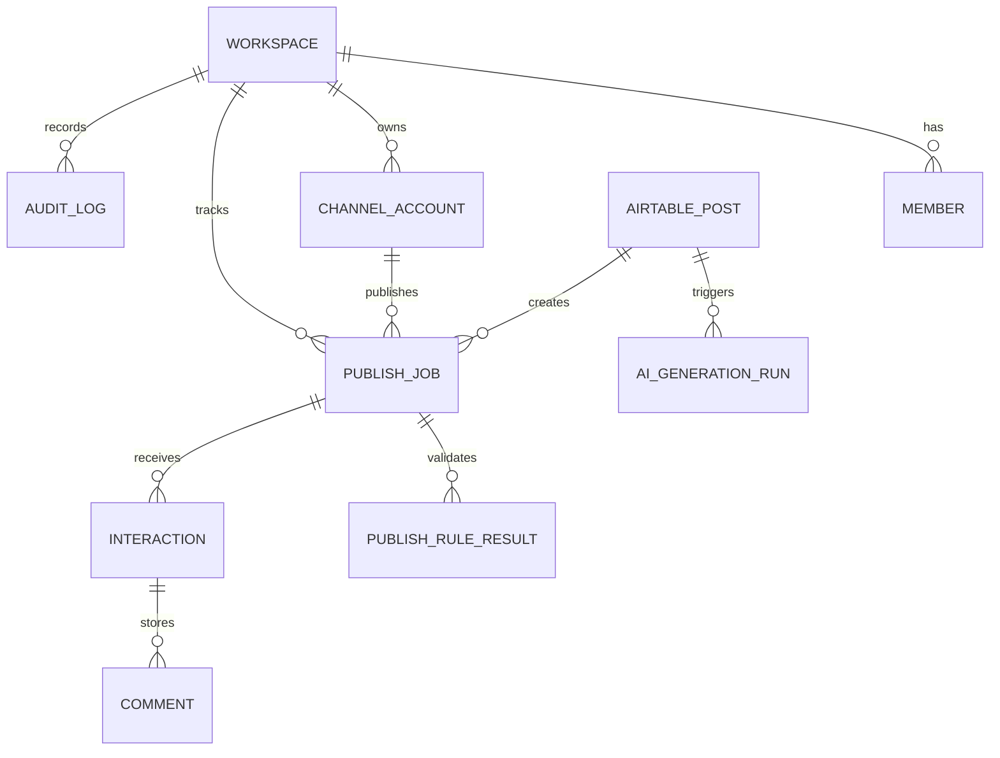
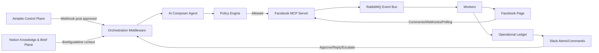
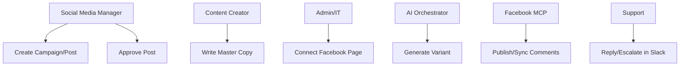

# TÀI LIỆU SRS DỰ ÁN MEDIAOPS COMPOSABILITY

## 1. Giới thiệu (Introduction)

### 1.1 Mục đích (Purpose)

Dự án **MediaOps Composability** hướng đến việc xây dựng một hệ sinh thái quản lý truyền thông đa kênh theo kiến trúc tích hợp hệ sinh thái, nhằm:

1. **Tập trung hóa quy trình quản lý nội dung**
   * Social Media Manager quản lý campaign, post, lịch đăng, trạng thái duyệt và asset trong Airtable; quản lý brief/guideline/policy trong Notion.
2. **Tự động hóa nội dung bằng AI có kiểm soát**
   * AI Orchestrator lắng nghe thay đổi trạng thái, tạo biến thể nội dung, kiểm tra policy và tạo publish job.
3. **Giảm nợ kỹ thuật tích hợp nền tảng**
   * AI Agent không gọi API mạng xã hội trực tiếp mà gọi MCP server chuyên biệt cho từng nền tảng.
4. **Tăng tốc phản hồi và kiểm soát rủi ro**
   * Slack/Teams nhận cảnh báo comment, publish failure, legal rejection và cho phép duyệt/phản hồi qua command.
5. **Tạo nguồn dữ liệu sạch cho audit và báo cáo**
   * Operational Ledger lưu job, event, audit, interaction cache và dữ liệu phục vụ reporting.

### 1.2 Phạm vi hệ thống (System scopes)

1. **Phạm vi chức năng**
   * Control Plane CMS: Airtable base/interface cho campaign, post, variant, approval, channel.
   * Knowledge & Brief Plane: Notion workspace cho campaign brief, brand guideline, content guideline, legal policy, retrospective.
   * Orchestration Middleware: nhận webhook, chạy AI, policy, routing đến MCP.
   * Facebook MCP Server: validate, enqueue, publish, sync comment.
   * Communication Plane: Slack alert và slash command.
   * Event Bus/Queue: RabbitMQ cho webhook event, publish job, comment/direct message ingestion, alert và retry.
   * Operational Ledger: audit log, publish job, webhook event, comment/direct message cache.

2. **Phạm vi địa lý**
   * MVP phục vụ đội marketing tại Việt Nam.

3. **Phạm vi đối tượng sử dụng**
   * CMO: xem báo cáo, trạng thái campaign, audit và hiệu quả kênh.
   * Social Media Manager: tạo kế hoạch, duyệt bài, theo dõi lịch, xử lý cảnh báo.
   * Content Creator: viết master copy, nhận đề xuất AI, chỉnh nội dung.
   * Support: xử lý comment/alert từ Slack.
   * Admin/IT: quản lý token, MCP server, webhook, quyền và audit.

4. **Phạm vi công nghệ**
   * Control Plane: Airtable handles structured workflow data; Notion handles long-form brief and context.
   * Execution: MCP server theo nền tảng, bắt đầu với Facebook Page.
   * Communication: Slack MVP; Microsoft Teams phase sau.
   * Ledger: InsForge/Postgres hoặc Postgres-compatible backend.

5. **Phạm vi vận hành**
   * MVP xử lý Facebook Page publish + comments.
   * Chưa xử lý Messenger full inbox, multi-platform publish và ROI đa chạm nâng cao.

### 1.3 Mục tiêu hệ thống (System objectives)

1. **Mục tiêu kinh doanh**
   * Giảm thao tác thủ công khi tạo và publish nội dung.
   * Rút ngắn thời gian phản hồi comment/cảnh báo.
   * Tạo dữ liệu báo cáo minh bạch cho CMO.

2. **Mục tiêu phục vụ người dùng**
   * Cho phép team làm việc trong Airtable/Slack thay vì học thêm một app phức tạp.
   * Luồng duyệt rõ ràng, giảm publish nhầm.

3. **Mục tiêu công nghệ**
   * Tách AI orchestration khỏi API nền tảng bằng MCP.
   * Tách Control Plane/Knowledge Plane khỏi operational ledger để tránh quá tải Airtable hoặc Notion.
   * Có audit, idempotency, retry và policy guardrail.

4. **Mục tiêu vận hành**
   * Mọi publish đều có log.
   * Mọi webhook đều được lưu trạng thái xử lý.
   * Mọi command từ Slack đều được xác thực và phân quyền.

5. **Mục tiêu dài hạn**
   * Mở rộng sang LinkedIn, X, YouTube, TikTok bằng MCP server mới.
   * Hình thành multi-agent marketing operations platform.

---

## 2. Mô tả tổng quan về dự án (System overview)

### 2.1 Kiến trúc hệ thống (System architecture)

Hệ thống sử dụng kiến trúc **Composability với MCP Execution Plane**.

**Các thành phần chính:**

1. **Control Plane CMS**
   * Chức năng: quản lý campaign, post, variant, approval, lịch đăng, asset link, trạng thái.

2. **Orchestration & AI Middleware**
   * Công nghệ: Node.js/TypeScript service hoặc serverless functions.
   * Chức năng: nhận webhook, kiểm tra trạng thái, gọi AI Composer, chạy policy, tạo publish job.

3. **Execution Plane**
   * Công nghệ: MCP server chuyên biệt theo nền tảng.
   * Chức năng: expose tools cho AI/middleware: `validate_post`, `enqueue_publish`, `publish_post`, `sync_comments`, `reply_comment`.

4. **Operational Ledger**
   * Công nghệ: InsForge/Postgres.
   * Chức năng: lưu job, event, audit, interaction cache, token metadata, idempotency key.

5. **Communication Plane**
   * Công nghệ: Slack slash command MVP, Teams message extension phase sau.
   * Chức năng: nhận alert, duyệt/reject, phản hồi comment, escalate crisis.

6. **Authentication & Authorization**
   * OAuth cho Facebook/Slack.
   * Role mapping giữa Airtable/Slack user và workspace role.
   * Admin/Manager mới được approve auto-publish.

### 2.2 Các yếu tố bên ngoài tác động đến hệ thống

| Yếu tố | Tác động dự kiến | Giải pháp đề xuất |
| :--- | :--- | :--- |
| Meta API permission/app review | Có thể chậm hoặc giới hạn publish/comment | Thiết kế Facebook MCP độc lập, hỗ trợ test mode, ghi rõ permission cần xác minh |
| Airtable rate limit | Không phù hợp làm queue/inbox lớn | Airtable chỉ làm Control Plane; Ledger lưu event/job |
| Slack command security | Rủi ro giả mạo command | Verify signature, map user role, audit mọi command |
| AI hallucination | Có thể tạo nội dung sai/rủi ro | Policy engine + approval guardrail + không auto publish nếu fail rule |
| Nghị định/quy định nội dung | Cần kiểm soát nội dung nhạy cảm | Forbidden terms, legal review flag, crisis escalation |

---

## 3. Yêu cầu chức năng (Functional requirements)

### 3.1 Nhóm Social Media Manager / Content Creator

| TÊN CHỨC NĂNG | MÔ TẢ |
| :--- | :--- |
| FR-01 Quản lý Campaign trong Airtable | Tạo campaign, gán mục tiêu, thời gian, kênh, owner, trạng thái |
| FR-02 Quản lý Post Draft | Tạo master copy, asset link, CTA URL, lịch đăng dự kiến |
| FR-03 Duyệt Post | Chuyển trạng thái từ Draft/Review sang Approved để kích hoạt automation |
| FR-04 AI Composer | Middleware tạo biến thể Facebook từ master copy khi post Approved |
| FR-05 Policy Validation | Kiểm tra length, hashtag, CTA, forbidden terms, approval, channel token |

### 3.2 Nhóm Support / Operator

| TÊN CHỨC NĂNG | MÔ TẢ |
| :--- | :--- |
| FR-06 Slack Alert | Nhận cảnh báo publish failure, comment risk, legal rejection |
| FR-07 Slash Command Reply | Reply comment từ Slack command, command đi ngược về MCP server |
| FR-08 Escalation | Đánh dấu crisis/escalated và thông báo channel chuyên dụng |

### 3.3 Nhóm Admin / IT

| TÊN CHỨC NĂNG | MÔ TẢ |
| :--- | :--- |
| FR-09 Connect Facebook Page | Kết nối Page, lưu token server-side, map channel account |
| FR-10 Configure MCP Server | Quản lý endpoint/tool, health check, quota, retry |
| FR-11 Audit & Ledger | Xem job, event, audit log, error, response payload summary |
| FR-12 Role Mapping | Map Airtable/Slack user với workspace role |

### 3.4 Yêu cầu kiểm thử (Unit Test)

| MODULE | MÔ TẢ KIỂM THỬ |
| :--- | :--- |
| Airtable Webhook Handler | Nhận event hợp lệ, bỏ qua event không liên quan, chống duplicate |
| AI Composer | Tạo biến thể đúng platform, có CTA/UTM, không vượt policy |
| Policy Engine | Block khi thiếu approval/token/forbidden terms, warn khi thiếu UTM |
| Facebook MCP | Validate media/text, enqueue idempotent, publish success/failure |
| RabbitMQ Queues | Publish/consume event, retry, DLQ, không mất event khi worker lỗi |
| Slack Commands | Verify signature, kiểm tra role, ghi audit, trả lỗi rõ ràng |
| Comment Sync | Upsert không trùng, map comment đúng post/channel/campaign |

---

## 4. Yêu cầu về cơ sở dữ liệu (Database requirements)

### 4.1 Database Diagram

MVP dùng ERD mức khung:

### 4.2 Data Dictionary

Data dictionary chi tiết nằm trong `04_Product_Backlog.md` và `05_Function_Flow_Logic_Register.md`.

### 4.3 Sơ đồ luồng dữ liệu mức đỉnh

### 4.4 Use-case diagrams

---

## 5. Yêu cầu tích hợp hệ thống khác (Integration requirements)

### 5.1 Airtable Control Plane

1. **Purpose**
   * Quản lý campaign, post, approval, lịch đăng, asset.
2. **Scope**
   * MVP dùng Airtable base và webhook khi record chuyển trạng thái.
3. **Functional requirements**
   * Khi `Post.status = Approved`, webhook gửi event đến middleware.
   * Middleware lấy record chi tiết, chống duplicate và tạo AI generation run.
4. **External interface**
   * Airtable Web API và Webhooks.
5. **Constraints**
   * Không dùng Airtable làm queue, audit store hoặc inbox khối lượng cao.

### 5.2 Notion Knowledge & Brief Plane

1. **Purpose**
   * Lưu campaign brief, brand guideline, content guideline, legal note, meeting note và retrospective.
2. **Scope**
   * MVP dùng Notion như nguồn ngữ cảnh cho AI Composer và tài liệu dự án vận hành.
3. **Functional requirements**
   * Campaign trong Airtable có link sang Notion Campaign Brief.
   * AI Orchestrator có thể đọc các trang guideline/brief đã được chỉ định.
   * Notion không dùng làm queue hoặc nguồn trạng thái publish chính.
4. **External interface**
   * Notion API hoặc manual link trong MVP nếu API chưa cần ngay.
5. **Constraints**
   * Không lưu token hoặc secret trong Notion.

### 5.3 RabbitMQ Event Bus / Queue

1. **Purpose**
   * Tách xử lý bất đồng bộ khỏi webhook receiver/MCP, đảm bảo retry, DLQ và worker scaling.
2. **Scope**
   * MVP dùng cho `airtable.webhook.approved`, `publish.facebook.requested`, `comments.facebook.ingest`, `alerts.slack.send`.
   * Phase sau dùng cho direct messages: `dm.facebook.ingest`, `dm.instagram.ingest`, `dm.zalo.ingest`.
3. **Functional requirements**
   * Mỗi event có `event_id`, `type`, `workspace_id`, `source`, `payload_ref`, `idempotency_key`, `attempt_count`.
   * Worker consume event theo queue riêng.
   * Event lỗi tạm thời retry với backoff.
   * Event lỗi vĩnh viễn đi vào dead-letter queue.
4. **External interface**
   * AMQP queues/exchanges.
5. **Constraints**
   * RabbitMQ không lưu trạng thái nghiệp vụ dài hạn; Postgres Ledger vẫn là source of truth.

### 5.4 Operational Ledger Database

1. **Purpose**
   * Lưu nguồn dữ liệu chính cho audit, job, conversation, message, interaction, reporting.
2. **Technology decision**
   * MVP dùng Postgres/InsForge.
   * NoSQL không thay thế Postgres trong MVP.
3. **Rationale**
   * Dữ liệu có quan hệ rõ: workspace, user, campaign, post, job, conversation, message, audit.
   * Cần transaction, unique constraint, idempotency, reporting SQL, RLS.
   * NoSQL phù hợp bổ sung sau cho raw event archive hoặc search index nếu cần.

### 5.5 Facebook MCP Server

1. **Purpose**
   * Đăng bài và đồng bộ bình luận Facebook Page qua MCP tools.
2. **Scope**
   * MVP: publish text/link post, sync comments.
3. **Functional requirements**
   * Validate nội dung trước publish.
   * Enqueue job với idempotency key.
   * Retry khi lỗi tạm thời, fail rõ ràng khi token/permission lỗi.
4. **External interface**
   * MCP tool calls; Graph API nằm trong MCP server.
5. **Constraints**
   * Permission Meta phải xác minh lại trước implementation production.

### 5.6 Slack Communication Plane

1. **Purpose**
   * Nhận alert và thao tác approve/reject/reply/escalate.
2. **Scope**
   * MVP dùng Slack trước Teams.
3. **Functional requirements**
   * Slash command phải verify signature.
   * Command phải map Slack user với role.
   * Mọi command ghi audit.
4. **External interface**
   * Slack slash commands, incoming messages/webhooks.
5. **Constraints**
   * Teams triển khai phase sau bằng Message Extension/Bot command, không dùng giả định slash command giống Slack.
