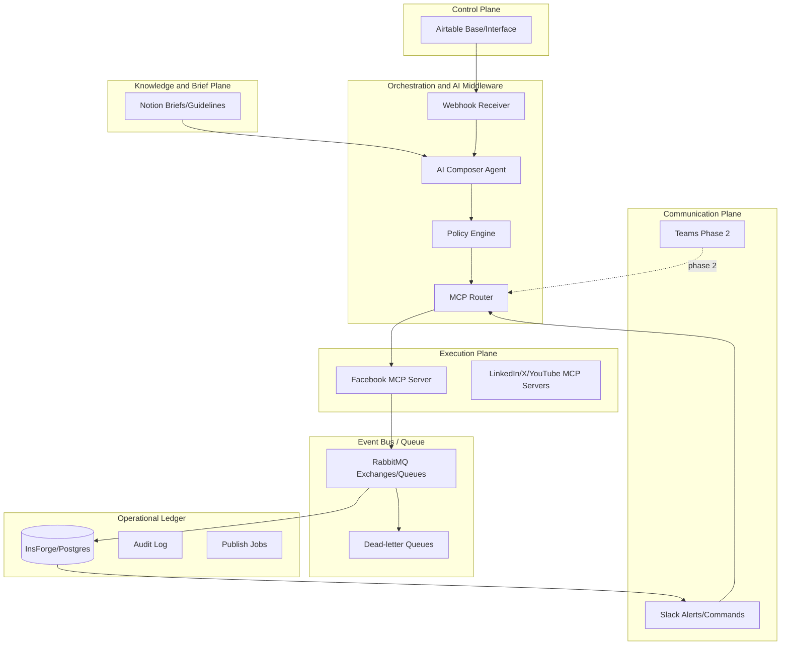

# Architecture: Composability for MediaOps

## 1. Architectural Decision

MediaOps chọn kiến trúc Composability thay vì custom SaaS nguyên khối.

Lý do:

- Social Media Manager needs an editable workspace; Airtable handles structured workflow, Notion handles long-form briefs and guidelines.
- AI Agent cần thao tác qua tool boundary rõ ràng, MCP phù hợp hơn hard-coded API calls.
- Queue, audit, retry, token and command security do not belong in Airtable or Notion.
- RabbitMQ owns event bus/queue behavior; Postgres/InsForge remains the source of truth.
- Slack/Teams là nơi team phản ứng nhanh với cảnh báo và comment.

## 2. Layered Architecture

## 3. Control Plane

MVP uses Airtable as the Control Plane.

Responsibilities:

- Campaign/post management.
- Calendar view.
- Approval status.
- Asset reference.
- Human editing and review.

Non-responsibilities:

- Queue processing.
- Audit ledger.
- Token storage.
- High-volume inbox.
- Retry/idempotency.

## 4. Knowledge & Brief Plane

MVP uses Notion as the Knowledge & Brief Plane.

Responsibilities:

- Campaign brief.
- Brand guideline.
- Content guideline.
- Legal note.
- Meeting notes.
- Sprint review/retrospective notes.

Non-responsibilities:

- Publish status source of truth.
- Queue processing.
- Token storage.
- Audit ledger.

Integration rule:

- Airtable Campaign contains `Notion Brief URL`.
- AI Orchestrator reads only linked or allowlisted Notion pages.
- AI run stores the context references used.

## 5. Orchestration & AI Middleware

Responsibilities:

- Receive Airtable webhooks.
- Load Notion campaign/guideline context when configured.
- Normalize event.
- Prevent duplicate workflow.
- Run AI Composer.
- Run Policy Engine.
- Route allowed actions to MCP.
- Update Airtable status and Ledger.

Default fail mode:

- Fail closed for publish.
- Retry only for temporary infrastructure/API errors.
- Alert Slack on manual intervention needed.

## 6. MCP Execution Plane

Facebook MCP Server MVP tools:

- `validate_post(input)`: validates text, link, media and policy snapshot.
- `enqueue_publish(input)`: creates idempotent publish job.
- `publish_post(job_id)`: performs Facebook publish.
- `sync_comments(input)`: fetches/upserts comments.
- `reply_comment(input)`: replies to a comment when authorized.
- `get_rate_limit_status(input)`: returns quota state.

Design rules:

- MCP owns platform-specific API complexity.
- AI Agent never stores long-lived platform tokens.
- MCP logs no raw token.
- MCP exposes stable tool contracts for orchestrator.

## 7. RabbitMQ Event Bus / Queue

RabbitMQ is used for asynchronous work, not as the long-term system of record.

Queues:

- `airtable.webhook.approved`
- `publish.facebook.requested`
- `comments.facebook.ingest`
- `dm.facebook.ingest`
- `dm.instagram.ingest`
- `dm.zalo.ingest`
- `alerts.slack.send`
- `replies.platform.send`
- `*.dlq`

Responsibilities:

- Buffer spikes from webhooks/comments/direct messages.
- Decouple webhook receiver, MCP server and workers.
- Retry temporary failures.
- Route permanent failures to DLQ.
- Enable worker scaling per workload.

Rules:

- RabbitMQ message payload contains references, not raw tokens or large message bodies.
- Workers must be idempotent.
- Ledger stores durable status.

## 8. Communication Plane

Slack MVP:

- Alerts for publish failure, risk comment, legal rejection, token issue.
- Commands: `/approve_post`, `/reject_post`, `/reply_comment`, `/escalate`.

Teams Phase 2:

- Use Message Extensions/Bot Framework commands, not Slack-like slash command assumptions.

## 9. Operational Ledger

Core entities:

- `workspace`
- `member`
- `channel_account`
- `token_reference`
- `airtable_record_snapshot`
- `webhook_event`
- `ai_generation_run`
- `publish_rule_result`
- `publish_job`
- `conversation`
- `message`
- `interaction`
- `comment`
- `slack_command_event`
- `audit_log`

Security:

- RLS by `workspace_id`.
- Append-only audit.
- Token reference only; actual token in secret store.
- Command signatures verified before action.

## 10. Database Decision: Postgres vs NoSQL

Recommendation: keep Postgres/InsForge as the primary Operational Ledger.

Why Postgres:

- Strong relational model for workspace, campaign, post, job, conversation, message and audit.
- Transaction and unique constraints for idempotency.
- SQL reporting for CMO and operations.
- RLS fits workspace security.
- Append-only audit logs are straightforward.

Where NoSQL may help later:

- Raw webhook archive.
- Full-text/search index for messages.
- High-volume analytics store.
- Vector/RAG context store if needed.

Decision:

- MVP: Postgres/InsForge primary ledger + RabbitMQ queue.
- Optional later: add NoSQL/search store as read-optimized adjunct, not source of truth.

## 11. Initial Deployment Shape

Sprint 0:

- Documentation, Airtable schema, architecture, backlog.

Sprint 1:

- Airtable base + Notion workspace + RabbitMQ setup + webhook receiver + Ledger schema.

Sprint 2:

- AI Composer + Policy Engine.

Sprint 3:

- Facebook MCP validate/enqueue/publish.

Sprint 4:

- Comment sync + Slack alerts/commands.

Sprint 5:

- Reporting, security audit, hardening.
