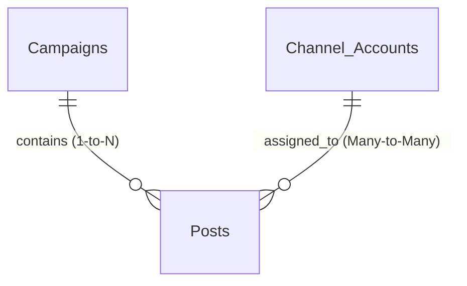

# AI-SDLC Retrofit Header for US-001

status: approved

## Goal

Maintain US-001 behavior for Airtable Campaign and Post Workflow Base according to the approved backlog, function flow, and implementation evidence.

## Tasks

- AC-001: Preserve the documented trigger, processing, and output workflow.
- AC-002: Preserve tenant isolation, idempotency, and durable Ledger/audit evidence where applicable.
- AC-003: Preserve zero-token and reference-only security boundaries.
- AC-004: Keep the story compatible with build, lint, tests, and AI-SDLC artifact validation.

## Done When

- AC-001: Story workflow matches the accepted implementation report and function flow register.
- AC-002: Ledger, idempotency, queue, and role/security constraints are documented or tested where applicable.
- AC-003: No raw tokens or oversized/raw provider payloads cross forbidden boundaries.
- AC-004: `npm run ai-sdlc:check -- US-001` passes after retrofit artifacts are present.

# US-001 Airtable Data Model

**Date:** 2026-05-20  
**Task:** T-002 Airtable Data Model Design  
**User Story:** US-001 — Thiết lập Airtable base cho campaign/post workflow  
**Status:** Completed  
**Author:** Backend/API Architect acting as Airtable Schema Designer  

---

## 1. Title: US-001 Airtable Data Model

Tài liệu này định nghĩa chi tiết cấu trúc dữ liệu (Data Model / Schema) mức logic cho Airtable Base trong dự án **MediaOps Composability**. Đây là nền tảng để Database Architect thực hiện cấu hình kiểu dữ liệu vật lý (T-003) và thiết lập các Guardrail (T-005) sau này.

---

## 2. Docs Read

Quy trình thiết kế tuân thủ nghiêm ngặt các tài liệu dự án theo thứ tự ưu tiên:

| Priority | Document | Key Architectural & Logical Constraints Extracted |
|:---|:---|:---|
| **P0** | [US-001-scope-lock.md](file:///d:/Muti-Media%20Management/docs/plans/US-001-scope-lock.md) | Khóa chặt danh sách bảng (Campaigns, Posts, Channel Accounts stub), 6 trạng thái Post, quy tắc BR1-BR3, và cấm tích hợp webhook/automation/AI trong Airtable ở US-001. |
| **P0** | [REPORT-us-001-product-scope-lock-2026-05-20.md](file:///d:/Muti-Media%20Management/docs/reports/REPORT-us-001-product-scope-lock-2026-05-20.md) | Thống nhất đề xuất các giá trị trạng thái cho Campaigns, loại bỏ bảng Assets độc lập để tiết kiệm dung lượng, và xác định Channel Accounts chỉ là stub. |
| **P0** | [PLAN-us-001-airtable-base.md](file:///d:/Muti-Media%20Management/docs/plans/PLAN-us-001-airtable-base.md) | Sơ đồ phụ thuộc T-002 -> T-003 -> T-004 & T-005, xác định vai trò của Schema Designer. |
| **P0** | [06_Architecture_Composability.md](file:///d:/Muti-Media%20Management/docs/architecture/06_Architecture_Composability.md) | Định vị Airtable thuộc tầng **Control Plane** (chỉ quản lý workflow, không phải hàng đợi queue, audit ledger hay token store). |
| **P0** | [11_Coding_Convention.md](file:///d:/Muti-Media%20Management/docs/architecture/11_Coding_Convention.md) | Quy định cấm tuyệt đối việc lưu trữ raw token trong Airtable (Coding Convention §5). |
| **P1** | [04_Product_Backlog.md](file:///d:/Muti-Media%20Management/docs/requirements/04_Product_Backlog.md) | Các tiêu chí nghiệm thu AC1-AC4 và các quy tắc nghiệp vụ BR1-BR3 cho US-001. |
| **P1** | [05_Function_Flow_Logic_Register.md](file:///d:/Muti-Media%20Management/docs/requirements/05_Function_Flow_Logic_Register.md) | Luồng FL-001 xác nhận webhook thuộc US-002. Tránh xây dựng logic xử lý tự động trong bước này. |
| **P2** | [07_Risk_Assumption_Decision_Log.md](file:///d:/Muti-Media%20Management/docs/project-mgmt/07_Risk_Assumption_Decision_Log.md) | Quyết định D-002 (Airtable làm Control Plane MVP) và rủi ro R-005 (rò rỉ token). |
| **P2** | [03_SRS_MediaOps_Composability.md](file:///d:/Muti-Media%20Management/docs/requirements/03_SRS_MediaOps_Composability.md) | Ranh giới tích hợp hệ thống ngoại vi và giới hạn lưu lượng để tránh quá tải Airtable. |

---

## 3. Design Summary

Bản thiết kế này phản ánh tư duy thiết kế hệ thống phân rã (Composability) hiện đại:
1. **Control Plane Isolation (Cô lập Control Plane)**: Airtable đóng vai trò giao diện nhập liệu và điều phối luồng công việc cho con người (Social Media Manager, Creator). Toàn bộ dữ liệu nhạy cảm (OAuth access tokens) và dữ liệu thô (comments, direct messages) được chuyển sang **Operational Ledger** (Postgres) và **Secret Storage**, không xuất hiện trên Airtable.
2. **Linked Account Stub (Liên kết tài khoản tối giản)**: Thay vì gán cứng tên kênh bằng trường Text, `Posts` liên kết trực tiếp với bảng stub `Channel Accounts` thông qua Linked Record. Giải pháp này giúp việc kiểm duyệt kết nối Facebook Page (BR2) đạt độ tin cậy tuyệt đối tại tầng database nhờ công thức Rollup trạng thái kết nối.
3. **Decoupled Assets (Tách biệt Tài nguyên)**: Tài nguyên đa phương tiện (hình ảnh, video) được quản lý dưới dạng danh sách URL chỉ hướng (`asset_links`) thay vì upload tệp đính kèm trực tiếp vào Airtable, đảm bảo cơ sở dữ liệu luôn nhẹ, hoạt động mượt mà và không phát sinh chi phí lưu trữ tệp tin khổng lồ.
4. **Idempotent Handoff (Bàn giao bất biến)**: Điểm tích hợp chính với Middleware sẽ là một **Airtable View lọc sẵn trạng thái Approved** (`Approved Handoff`). Middleware sẽ sử dụng Airtable Record ID (`recXXXXX`) làm khóa phân biệt duy nhất để đảm bảo tính bất biến (idempotency) khi xử lý tác vụ đăng bài.

---

## 4. Table Inventory

Airtable Base dành cho MVP US-001 gồm đúng 3 bảng logic sau:

| # | Table Name | Purpose | Data Ownership | Expected Volume |
|:---|:---|:---|:---|:---|
| 1 | **Campaigns** | Quản lý thông tin chiến dịch marketing cấp cao, thời gian chạy và link tài liệu brief. | Social Media Manager (SMM) | Thấp (~10 - 50 bản ghi/năm) |
| 2 | **Posts** | Bảng cốt lõi quản lý nội dung bài viết, tệp phương tiện, trạng thái duyệt và lịch đăng bài. | Content Creator & SMM | Trung bình (~100 - 1000 bản ghi/tháng) |
| 3 | **Channel Accounts** | Stub tham chiếu danh sách các tài khoản/trang mạng xã hội đã được kết nối vào hệ thống. | Admin/IT (đọc từ Ledger đồng bộ sang) | Rất thấp (~5 - 10 bản ghi) |

---

## 5. Campaigns Table Spec

Bảng `Campaigns` lưu trữ ngữ cảnh cấp cao của chiến dịch quảng cáo.

### Schema Spec
| Field Name | Field Purpose | Required? | Relationship / Logic Notes |
|:---|:---|:---|:---|
| `campaign_id` | Định danh chiến dịch thân thiện với con người. | **Yes** | Dùng làm trường hiển thị chính (Primary Field). Tạo bằng công thức tự động (Formula) có prefix, ví dụ: `CMP-` kết hợp Autonumber. |
| `name` | Tên chiến dịch quảng cáo. | **Yes** | Single-line text. Trực quan cho SMM. |
| `objective` | Mục tiêu chiến dịch (brand awareness, lead gen, v.v.). | No | Long text hoặc Single-select. |
| `start_date` | Ngày bắt đầu chạy chiến dịch. | **Yes** | Date (chỉ ngày). Cần thiết để kiểm tra thời gian chạy post. |
| `end_date` | Ngày kết thúc chiến dịch. | **Yes** | Date (chỉ ngày). Phải lớn hơn hoặc bằng `start_date`. |
| `owner` | Người chịu trách nhiệm chính của chiến dịch. | **Yes** | Collaborator hoặc Single-select (danh sách thành viên). |
| `status` | Trạng thái chiến dịch. | **Yes** | Single-select. Đề xuất gồm 4 trạng thái: `Draft`, `Active`, `Paused`, `Completed`. |
| `notion_brief_url` | Đường dẫn tài liệu Brief chi tiết chiến dịch trên Notion. | No | URL field. Chỉ lưu reference link, không chạy Notion API tích hợp trong US-001. |
| `posts` | Danh sách bài viết thuộc chiến dịch này. | No | Linked record (1-to-Many) liên kết ngược đến bảng `Posts`. |

*Ghi chú đề xuất cho T-003:* Trường `status` của chiến dịch mặc định khi tạo mới là `Draft`.

---

## 6. Posts Table Spec

Bảng `Posts` là trái tim của quy trình kiểm duyệt nội dung.

### Schema Spec
| Field Name | Field Purpose | Required? | Relationship / Logic Notes |
|:---|:---|:---|:---|
| `post_id` | Định danh bài viết thân thiện với con người. | **Yes** | Primary Field. Tạo bằng Formula tự động với prefix, ví dụ: `PST-` kết hợp Autonumber. |
| `campaign_id` | Chiến dịch mà bài viết này thuộc về. | **Yes** | Linked record (Many-to-1) trỏ đến bảng `Campaigns`. |
| `title` | Tiêu đề nội dung bài viết (phục vụ quản lý nội bộ). | **Yes** | Single-line text. Giúp phân biệt bài viết trên lịch hoặc kanban. |
| `master_copy` | Nội dung cốt lõi của bài viết do Creator biên soạn. | **Yes** (khi duyệt) | Long text (chế độ rich text hoặc plain text). Là nguyên liệu đầu vào cho AI Composer tạo biến thể. Bắt buộc có dữ liệu trước khi chuyển `status` sang `Approved` (BR1). |
| `cta_url` | Đường dẫn hành động (Call To Action link) đính kèm bài viết. | No | URL field. Có thể chứa mã UTM để theo dõi hiệu quả. |
| `asset_links` | Danh sách các link tài nguyên ảnh/video (Drive/S3...). | No | Long text. Mỗi link đặt trên một dòng. Tránh dùng Attachment field của Airtable để tối ưu bộ nhớ. |
| `target_channels` | Nền tảng muốn đăng bài viết này lên. | **Yes** | Multi-select. Giá trị ban đầu bắt buộc hỗ trợ: `Facebook`. Các kênh tương lai: `LinkedIn`, `Twitter`, `Zalo`. |
| `connected_channel_accounts` | Tài khoản/Trang cụ thể sẽ đăng bài viết này. | **Yes** (khi duyệt) | Linked record (Many-to-Many) liên kết tới bảng `Channel Accounts`. Giúp xác thực quy tắc BR2. |
| `scheduled_at` | Thời điểm lên lịch phát sóng bài viết. | **Yes** (khi duyệt) | Date-time field (kèm giờ giấc cụ thể). Bắt buộc có dữ liệu trước khi chuyển sang trạng thái `Review`/`Approved`/`Scheduled` và thời gian này phải lớn hơn thời gian hiện tại (BR3). |
| `status` | Trạng thái phê duyệt của bài viết. | **Yes** | Single-select. Đúng 6 giá trị: `Draft`, `Review`, `Approved`, `Scheduled`, `Published`, `Failed`. Mặc định khi tạo mới là `Draft`. |
| `reviewer` | Người thực hiện phê duyệt/đánh giá bài viết. | No | Collaborator hoặc Single-select. Đại diện cho Manager. |
| `approved_at` | Thời điểm bài viết được chính thức duyệt. | No | Date-time field. Do hệ thống tự cập nhật hoặc công thức ghi nhận khi trạng thái chuyển sang `Approved`. |

---

## 7. Channel Accounts Table Spec

Bảng stub tham chiếu danh sách tài khoản mạng xã hội liên kết.

### Schema Spec
| Field Name | Field Purpose | Required? | Relationship / Logic Notes |
|:---|:---|:---|:---|
| `channel_account_id` | Định danh duy nhất của tài khoản kết nối. | **Yes** | Primary Field. Tạo bằng Formula kết hợp `platform` và `display_name` (ví dụ: `Facebook: MediaOps Tech Page`). |
| `platform` | Nền tảng mạng xã hội của tài khoản. | **Yes** | Single-select. Giá trị ban đầu: `Facebook`. |
| `display_name` | Tên hiển thị của trang/tài khoản (ví dụ tên Page). | **Yes** | Single-line text. |
| `status` | Trạng thái kết nối của tài khoản. | **Yes** | Single-select. Gồm 3 giá trị: `Connected`, `Disconnected`, `Expired`. |
| `posts` | Danh sách bài đăng liên kết tới tài khoản này. | No | Linked record (Many-to-Many) liên kết ngược lại bảng `Posts`. |

> [!IMPORTANT]
> **Không thiết lập các trường chứa mã bảo mật (token, secret, OAuth credentials)** trong bảng này. Bảng này chỉ lưu stub hiển thị nhằm hỗ trợ kiểm duyệt nghiệp vụ BR2. Toàn bộ mã token bảo mật thực tế được lưu tại Secret Storage của server.

---

## 8. Assets Handling Decision

Trong quá trình phân tích kỹ thuật, Schema Designer đưa ra quyết định kiến trúc chính thức về việc xử lý tệp tin đa phương tiện (Assets) như sau:

* **Quyết định:** **KHÔNG** tạo bảng `Assets` độc lập và **KHÔNG** dùng trường kiểu dữ liệu Attachment gốc của Airtable để lưu trữ tệp ảnh/video trực tiếp.
* **Lý do kỹ thuật:**
  1. **Tối ưu chi phí & dung lượng**: Tài nguyên ảnh và video gốc của bộ phận marketing có dung lượng lớn. Sử dụng Attachment của Airtable sẽ nhanh chóng làm cạn kiệt giới hạn lưu trữ của gói Airtable (thường giới hạn ở mức 20GB - 100GB tùy gói doanh nghiệp), đẩy chi phí tăng cao phi lý.
  2. **Tránh đồng bộ nặng nề**: Khi Middleware hoặc MCP nhận webhook và cần tải tệp từ Airtable, việc xử lý tệp nhị phân thông qua API Airtable tạo ra tải trọng mạng không đáng có.
  3. **Decoupled Hosting (Tách biệt lưu trữ)**: Quy chuẩn thiết kế tối giản khuyên khích lưu trữ Assets tại các kho lưu trữ chuyên dụng (như AWS S3, Google Drive, Cloudinary) và chỉ lưu trữ đường dẫn tham chiếu dạng văn bản (`asset_links` - văn bản nhiều dòng chứa URLs) trong Control Plane. Điều này giữ cho Airtable Base luôn cực nhẹ và hoạt động với hiệu năng cao nhất.

---

## 9. Relationships

Sơ đồ quan hệ thực thể (ERD) mức logic giữa các bảng trong Airtable Base:

### Chi tiết các mối liên kết:
1. **Campaigns (1) ↔ (N) Posts**:
   * Một chiến dịch (`Campaigns`) chứa nhiều bài viết (`Posts`).
   * Một bài viết (`Posts`) bắt buộc phải thuộc về một chiến dịch (`Campaigns`) cụ thể.
   * Liên kết được thể hiện thông qua trường `campaign_id` trên bảng `Posts` (Linked Record trỏ đến bảng `Campaigns`).

2. **Channel Accounts (Stub) (Many) ↔ (Many) Posts**:
   * Một bài đăng (`Posts`) có thể được cấu hình để đăng lên một hoặc nhiều tài khoản liên kết (`connected_channel_accounts`). Ví dụ: Đăng đồng thời lên Page Facebook cá nhân và Page Facebook doanh nghiệp.
   * Một tài khoản liên kết (`Channel Accounts`) có thể chứa lịch sử đăng của nhiều bài đăng (`Posts`).
   * Liên kết được thể hiện thông qua trường `connected_channel_accounts` trên bảng `Posts` (Linked Record trỏ đến bảng `Channel Accounts`).

---

## 10. Handoff-Relevant Fields

Handoff sang Middleware của dự án chỉ sử dụng các **Trường Tham chiếu (References)** và **Siêu dữ liệu trạng thái (Metadata)**. Tuyệt đối không bàn giao dữ liệu thô cồng kềnh hoặc thông tin bảo mật.

Trường dữ liệu xuất hiện tại View `Approved Handoff` phục vụ Middleware (FL-001 / US-002) quét hoặc nhận qua Webhook bao gồm:

| Field Name | Type | Purpose in Handoff |
|:---|:---|:---|
| `Airtable Record ID` | System Field | Khóa chính bất biến để Middleware truy vấn chi tiết qua API và làm ID đối soát idempotency key. |
| `post_id` | Formula / String | Định danh thân thiện phục vụ log lỗi, gửi cảnh báo Slack dễ đọc. |
| `campaign_id` | Linked Record ID | Liên kết chiến dịch để Middleware nạp ngữ cảnh khi cần thiết. |
| `status` | String / Select | Bắt buộc phải là `Approved` tại thời điểm handoff. |
| `target_channels` | Array of Strings | Danh sách các nền tảng đích để Middleware định tuyến công việc. |
| `scheduled_at` | ISO Date-Time String | Thời gian lên lịch để Queue Worker lên lịch thực thi chính xác. |
| `approved_at` | ISO Date-Time String | Thời điểm phê duyệt phục vụ ghi nhận Ledger Audit. |

---

## 11. Data Model Constraints for T-003

Để hỗ trợ Database Architect thực hiện bước tiếp theo (T-003: Field Types and Constraints) một cách chuẩn xác, Schema Designer đề xuất các ràng buộc dữ liệu quan trọng sau đây:

### Ràng buộc nullability & Nghiệp vụ (BR1 - BR3)
1. **BR1 (Không duyệt bài trống):**
   * Nếu `status` chuyển sang `Approved`, bắt buộc trường `master_copy` không được rỗng (`NOT NULL`).
   * *Đề xuất triển khai ở T-003/T-005:* Tạo một trường công thức kiểm tra `is_valid_for_approval` trả về `0` hoặc `1`. Nếu `master_copy` trống, trả về `0`.

2. **BR2 (Bảo vệ liên kết tài khoản Facebook):**
   * Nếu `target_channels` chứa giá trị `Facebook`, bắt buộc trường `connected_channel_accounts` phải liên kết đến ít nhất một bản ghi trong bảng `Channel Accounts` có trường `platform = Facebook` và `status = Connected`.
   * *Đề xuất triển khai ở T-003/T-005:* Sử dụng Rollup field đếm số tài khoản Facebook hợp lệ được liên kết để dùng trong điều kiện lọc hoặc kiểm duyệt tự động.

3. **BR3 (Lên lịch trong tương lai):**
   * Khi `status` của bài đăng chuyển sang các trạng thái chuẩn bị phát sóng (`Review`, `Approved`, `Scheduled`), bắt buộc trường `scheduled_at` phải lớn hơn thời điểm thực tế hiện tại (`scheduled_at > NOW()`).
   * *Đề xuất triển khai ở T-003/T-005:* Thiết lập trường công thức so sánh `scheduled_at` với `NOW()`. Nếu phát hiện lên lịch trong quá khứ, đánh dấu cờ vi phạm logic.

---

## 12. Out-of-Scope Confirmations

Schema Designer khẳng định các thành phần sau nằm hoàn toàn **ngoài phạm vi thiết kế (Out of Scope)** của T-002:

- **Không tạo** bất kỳ trường lưu trữ Token bảo mật hay Mật khẩu nào trên bảng `Channel Accounts`.
- **Không cấu hình** Webhook tích hợp hay Webhook URL trên Airtable (đây là nhiệm vụ của US-002 / T-006).
- **Không xây dựng** bất kỳ kịch bản tự động hóa (Airtable Automations) hay script xử lý dữ liệu nào trong Airtable (đây là nhiệm vụ của T-005 / T-006).
- **Không thiết kế** các trường chứa kết quả xử lý của AI (AI variants, policy engine output, tokens used) trong bảng Posts. Bản thiết kế này chỉ chứa trường cốt lõi phục vụ luồng nghiệp vụ gốc của con người.
- **Không thiết kế** các bảng chứa bộ nhớ tạm cho bình luận (comments cache) hay hộp thư đến (direct message inbox). Các thành phần này thuộc về Operational Ledger (Postgres) theo tài liệu kiến trúc.

---

## 13. Risks / Open Questions

| ID | Risk / Ambiguity | Impact | Database-level Mitigation |
|:---|:---|:---|:---|
| **R-01** | Ràng buộc nghiệp vụ gốc của Airtable yếu, không thể khóa cứng nút đổi trạng thái nếu thiếu điều kiện bằng giao diện bảng Grid thông thường. | Người dùng có thể vô tình chuyển `status` sang `Approved` bằng tay dù thiếu `master_copy` (vi phạm BR1). | *Giải pháp:* T-004/T-005 sẽ cấu hình View lọc hoặc sử dụng Airtable Interface Form kiểm soát đầu vào, kết hợp trường cờ hiệu cảnh báo trạng thái lỗi `is_invalid = true`. |
| **Q-01** | SMM có thể đăng một bài viết lên nhiều Facebook Pages cùng lúc không? | Ảnh hưởng đến việc thiết kế trường `connected_channel_accounts` là liên kết đơn hay liên kết đa bản ghi. | *Quyết định:* Thiết kế mối quan hệ **Many-to-Many** giữa `Posts` và `Channel Accounts`. Cho phép chọn nhiều tài khoản để tăng tính linh hoạt tối đa cho marketing đa Page. |
| **Q-02** | Ai sở hữu quyền thay đổi trạng thái phê duyệt sang `Approved`? | Quyết định cơ chế bảo mật của luồng phê duyệt. | *Ghi nhận:* Đây là câu hỏi mở Q-005 của dự án. Tầng database Airtable sẽ chuẩn bị sẵn trường `reviewer` (Collaborator) để sẵn sàng ánh xạ quyền phê duyệt ở tầng ứng dụng hoặc Interface. |

---

## 14. Handoff Notes for T-003 Field Types and Constraints

*Gửi Database Architect thực hiện T-003:*
* Bạn có thể sử dụng cấu trúc 3 bảng logic này để xây dựng bảng ánh xạ kiểu dữ liệu vật lý (Field Type Matrix).
* Đặc biệt lưu ý việc triển khai các trường kiểm tra bằng Formula (ví dụ: đối chiếu `scheduled_at` với hàm `NOW()`, đếm liên kết của `connected_channel_accounts`) để chuẩn bị nguyên liệu cho tầng bảo vệ an toàn dữ liệu (Approval Guardrails - T-005).
* Đảm bảo cấu hình các trường liên kết Linked Record thiết lập đúng quan hệ hai chiều giữa `Campaigns` ↔ `Posts` và `Channel Accounts` ↔ `Posts`.
