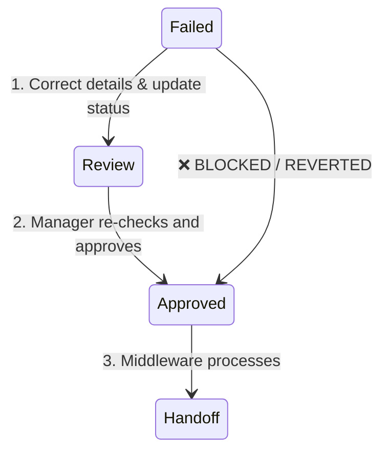

# US-001 Approval Guardrails

**Date:** 2026-05-20  
**Task:** T-005: Approval Guardrails  
**User Story:** US-001 — Airtable Base Campaign/Post Workflow  
**Status:** Completed  
**Author:** Security Auditor / Governance Reviewer Agent  

---

## 2. Docs Read

The design of the approval guardrails has been fully aligned with the architectural boundaries and constraints of the MediaOps platform. The following 13 documents were read and analyzed in chronological order to extract system-level constraints:

| Priority | Document | Key Security, Compliance & Logical Constraints Extracted |
|:---|:---|:---|
| **P0** | [PLAN-us-001-airtable-base.md](file:///d:/Muti-Media%20Management/docs/plans/PLAN-us-001-airtable-base.md) | Locked the dependencies (T-003 -> T-005) and verification criteria for approval safety gates. |
| **P0** | [US-001-workflow-views.md](file:///d:/Muti-Media%20Management/docs/plans/US-001-workflow-views.md) | Mapped views (`Approved Handoff` Clean Lane and `Invalid Approved` Exception Lane) to guardrail triggers. |
| **P0** | [REPORT-us-001-workflow-views-2026-05-20.md](file:///d:/Muti-Media%20Management/docs/reports/REPORT-us-001-workflow-views-2026-05-20.md) | Extracted view-level exceptions, timezone UTC locks, and the manual `Failed` recovery flow. |
| **P0** | [US-001-field-types-and-constraints.md](file:///d:/Muti-Media%20Management/docs/plans/US-001-field-types-and-constraints.md) | Locked physical fields (`is_valid_for_approval`, `approval_blockers`, `is_scheduled_in_future`). |
| **P0** | [REPORT-us-001-field-types-and-constraints-2026-05-20.md](file:///d:/Muti-Media%20Management/docs/reports/REPORT-us-001-field-types-and-constraints-2026-05-20.md) | Confirmed GMT/UTC locking and generalized platform stubs (no secrets in Airtable). |
| **P0** | [US-001-airtable-data-model.md](file:///d:/Muti-Media%20Management/docs/plans/US-001-airtable-data-model.md) | Verified 3-table structure and Many-to-Many relationship between Posts and Channel Accounts. |
| **P0** | [US-001-scope-lock.md](file:///d:/Muti-Media%20Management/docs/plans/US-001-scope-lock.md) | Locked boundaries: strictly no code, webhook receivers, secret storage, or runtime queues in Airtable. |
| **P0** | [06_Architecture_Composability.md](file:///d:/Muti-Media%20Management/docs/architecture/06_Architecture_Composability.md) | Confirmed Airtable is the Control Plane; operational ledger and secret stores reside server-side. |
| **P0** | [11_Coding_Convention.md](file:///d:/Muti-Media%20Management/docs/architecture/11_Coding_Convention.md) | Enforced §5: zero raw token storage; handoffs must use immutable Airtable Record IDs. |
| **P1** | [04_Product_Backlog.md](file:///d:/Muti-Media%20Management/docs/requirements/04_Product_Backlog.md) | Mapped US-001 AC1-AC4 and Business Rules BR1-BR3 to native database controls. |
| **P1** | [05_Function_Flow_Logic_Register.md](file:///d:/Muti-Media%20Management/docs/requirements/05_Function_Flow_Logic_Register.md) | Mapped webhook logic (FL-001) to ensure Airtable Record ID serves as the idempotency key. |
| **P2** | [07_Risk_Assumption_Decision_Log.md](file:///d:/Muti-Media%20Management/docs/project-mgmt/07_Risk_Assumption_Decision_Log.md) | Evaluated R-005 (token leakage), R-003 (AI/Content risks), and Q-005 (approval permissions). |
| **P2** | [03_SRS_MediaOps_Composability.md](file:///d:/Muti-Media%20Management/docs/requirements/03_SRS_MediaOps_Composability.md) | Reviewed Non-Functional Requirements (NFR) on database isolation and security parameters. |

---

## 3. Design Summary

Airtable acts as the **Control Plane** (human-facing interface), whereas the **Execution Plane** (AI Composer, Policy Engine, Facebook MCP, and RabbitMQ workers) is server-side. Airtable lacks database-level "required-on-status-change" constraints or transaction rollbacks for Grid views. This design implements **fail-secure, Airtable-native guardrails** to prevent human errors or malicious actors from publishing incomplete or unauthorized posts.

### Core Architectural Principles
1. **Zero Trust Integration Boundary**: The downstream middleware queries and triggers ONLY on the `Approved Handoff` view. We apply a hard database-level filter: `status = Approved AND is_valid_for_approval = 1`. 
2. **Fail-Closed Reversion**: If a user attempts to force a status change to `Approved` on a record that violates any Business Rule (`is_valid_for_approval = 0`), the record instantly drops out of the `Approved Handoff` view (the Clean Lane). An Airtable Automation instantly triggers, reverts the status back to `Review`, logs the event, and notifies the reviewer using the text generated by the `approval_blockers` formula.
3. **Strict Human Recovery Flow (Conservative Policy)**: Direct transitions from `Failed` to `Approved` are prohibited. Re-approving a failed post requires the sequential human path: `Failed` -> `Review` -> `Approved` after correcting the underlying issue. This forces a manual re-check of dates, channels, and copy validity.
4. **Timezone Integrity**: Date-time parameters (`scheduled_at`, `approved_at`, `start_date`, `end_date`) are locked to GMT/UTC to prevent publishing schedule drift.
5. **No Exposure of Secrets**: The Channel Accounts table remains a reference-only stub. Secret keys, OAuth access tokens, and API credentials are kept server-side in Secret Storage, completely separated from Airtable.

---

## 4. Guardrail Inventory

The following table summarizes the suite of Airtable-native guardrails designed for the base:

| Guardrail | Trigger / Condition | Detection Field | Recommended Action | User Feedback | Owner |
|:---|:---|:---|:---|:---|:---|
| **GR-01: Invalid Approved Lockout** | `status` changed to `Approved` AND `is_valid_for_approval = 0` | `is_valid_for_approval` | Revert `status` to `Review`; route to `Invalid Approved` view. | Native notification + dynamic error block on Interface showing `approval_blockers`. | SMM / Manager |
| **GR-02: Approved Timestamping** | `status` changed to `Approved` AND `is_valid_for_approval = 1` | `is_valid_for_approval` | Write current timestamp to `approved_at` (only if empty). | Visible `approved_at` value; record enters `Approved Handoff` Clean Lane. | Manager (Approver) |
| **GR-03: Needs Review Triaging** | `status` changed to `Review` AND `is_valid_for_approval = 0` | `approval_blockers` | Allow transition but flag blockers; display record in `Needs Review` view. | Interface alerts; warning text `approval_blockers` highlighted in red. | Content Creator |
| **GR-04: Failed Recovery Enforcement** | `status` changed from `Failed` directly to `Approved` | `status` (previous value) | Revert `status` to `Review` (conservative policy). | Interface message: "Failed posts must go through Review for human check." | SMM / Manager |
| **GR-05: Connected Account Verification** | Link to `connected_channel_accounts` missing or account inactive for selected target channels | `has_connected_channel_accounts` | Block/revert `status` from entering `Approved`; exclude from Clean Lane. | Interface warning: "Missing or inactive channel account connection stub." | SMM / Manager |
| **GR-06: Time-Travel Prevention** | `scheduled_at` is in the past when status is `Review`, `Approved`, or `Scheduled` | `is_scheduled_in_future` | Block/revert `status` to `Review`; route to `Invalid Approved` view if forced. | Interface warning: "scheduled_at must be set in the future." | SMM / Creator |

---

## 5. Business Rule Mapping

This matrix maps how the physical fields (from T-003) and guardrails (T-005) guarantee compliance with the core Business Rules:

| Business Rule | Product Requirement | Airtable-Native Guardrail Implementation | Failure Mode |
|:---|:---|:---|:---|
| **BR1** | Post cannot be `Approved` if missing `master_copy`. | Mapped to `is_master_copy_present` (T-003). Guardrail `GR-01` triggers if `status` is changed to `Approved` while this field is `0`. | **Fail Closed**: Reverts status to `Review`, hides record from handoff, and displays blocker. |
| **BR2** | Facebook target channel requires active/connected Facebook account reference. | Mapped to `has_connected_channel_accounts` via conditional rollup `connected_active_platforms` (T-003). `GR-05` blocks approval if mismatch is detected. | **Fail Closed**: Record drops from handoff, reverts status, and flags connection issue. |
| **BR3** | `scheduled_at` must be in the future when status is `Review`, `Approved`, or `Scheduled`. | Mapped to `is_scheduled_in_future` (T-003). `GR-06` flags records with past timestamps. If a valid `Approved` record passes its scheduled time while waiting in the queue, `is_valid_for_approval` automatically flips to `0`, instantly ejecting it from the `Approved Handoff` Clean Lane view. | **Fail Closed**: Record drops from Clean Lane; automation kicks status back to `Review` to prevent stale publishing. |

---

## 6. Invalid Approved Guardrail (GR-01)

### Trigger Condition
- `status` is set to `Approved` OR cell is edited to `Approved` in a grid view, AND `is_valid_for_approval = 0` (computed database formula field).

### Detection Mechanics
- The formula field `is_valid_for_approval` (from T-003) serves as the primary logic gate:
  ```excel
  IF(AND({is_master_copy_present}, {has_connected_channel_accounts}, {is_scheduled_in_future}), 1, 0)
  ```
- If any validation check fails, `is_valid_for_approval` evaluates to `0`.

### Reversion Logic
An Airtable-native Automation is configured on the `Posts` table:
1. **Trigger**: When a record matches conditions: `status = Approved` AND `is_valid_for_approval = 0`.
2. **Action 1 (Revert)**: Update Record -> Set `status = Review`.
3. **Action 2 (Notify)**: Send notification inside Airtable (Airtable-native notification/admin-visible Ledger note) to the user listed in `reviewer` (or the last modifier), logging the blockers:
   ```text
   ⚠️ Phê duyệt bất hợp lệ cho bài viết {post_id}: "{title}".
   Hệ thống đã tự động hoàn tác trạng thái về "Review" do vi phạm quy tắc phê duyệt:
   {approval_blockers}
   Vui lòng kiểm tra lại trước khi phê duyệt lại.
   ```

### Safe Exclusion
Because the `Approved Handoff` view strictly filters for:
```text
status = Approved AND is_valid_for_approval = 1
```
Any invalid approved record **never** enters the Clean Lane, preventing the downstream middleware from fetching or processing it. It is immediately routed to the `Invalid Approved / Approval Blocked` view (Exception Lane) for operator visibility.

---

## 7. Review Readiness Guardrail (GR-03)

### Trigger Condition
- `status` is set to `Review` by a Content Creator or SMM.

### Processing Behavior
- Grid views in Airtable do not support blocking user input at the database layer. SMMs and Creators must have the flexibility to transition a post to `Review` even if some fields are temporarily incomplete, allowing the reviewer to assist with editing.
- Therefore, the guardrail **allows** the transition to `Review` but activates immediate visual signaling:
  1. The record is routed to the `Needs Review` view.
  2. The formula field `approval_blockers` instantly computes and renders the precise errors in red (e.g., `❌ Thiếu nội dung Master Copy; `).
  3. The indicator `is_valid_for_approval` displays `0` as a clear stop sign.

### Interface lock recommendations
- When designing Interface Pages (T-004), the "Approve" button is dynamically disabled (read-only) if `is_valid_for_approval = 0`.

---

## 8. Valid Approved Handling (GR-02)

### Trigger Condition
- `status` is updated to `Approved` AND `is_valid_for_approval = 1`.

### Automation Mechanics
An Airtable-native Automation is configured on the `Posts` table:
1. **Trigger**: When a record matches conditions: `status = Approved` AND `is_valid_for_approval = 1`.
2. **Action**: Update Record -> Set `approved_at = Current time` (utilizing Airtable's native dynamic timestamp variable, `Last Modified Time` of the `status` field, or automation run time).
3. **Idempotency Safeguard**: The action only writes to `approved_at` if it is currently empty. This protects the original approval timestamp during future system reconciliations.

### Downstream Handoff
Once the timestamp is written, the record satisfies all filters and enters the `Approved Handoff` view. It becomes visible to the middleware for high-performance publishing queues.

---

## 9. Failed Recovery Guardrail (GR-04)

### The Recovery Path Constraint
Posts that fail during publication (due to Graph API limits, expired page tokens, or system glitches) are marked as `Failed` in the Postgres Ledger and synchronized to Airtable as `status = Failed`. SMMs manage these in the `Failed Posts` view.



### Automation Enforcement (Conservative Policy)
If an SMM attempts to bypass the triage pipeline and moves a post directly from `Failed` to `Approved`:
1. **Case A: Record is Invalid (`is_valid_for_approval = 0`)**:
   - The automation `GR-01` immediately catches this (since `status = Approved` and `is_valid_for_approval = 0`).
   - The status is reverted to `Review` and the operator is notified of the blockers.
2. **Case B: Record is Valid (`is_valid_for_approval = 1`)**:
   - Even if the record fields appear valid, a failed post always carries a past scheduled date (since it failed in the past). Because the date is in the past, `is_scheduled_in_future` evaluates to `0`, making the record invalid (`is_valid_for_approval = 0`).
   - This automatically triggers the revert to `Review`, forcing the operator to edit `scheduled_at` to a future date-time.
   - This conservative policy guarantees that a human SMM must actively re-schedule and re-triage the post, avoiding accidental duplicate publications of stale content.

---

## 10. Channel Account Guardrail (GR-05)

### Business Rule Validation (BR2)
This guardrail verifies that selected target channels match active connected social media accounts stubs. 
- The physical field `connected_active_platforms` (T-003) is a conditional rollup that concatenates the `platform` of linked records in the `Channel Accounts` table ONLY if their connection `status = Connected`.
- If a post's `target_channels` includes `Facebook`, the system evaluates `is_facebook_check_passed` (Formula field):
  ```excel
  IF(NOT(FIND("Facebook", {target_channels})), 1, IF(FIND("Facebook", {connected_active_platforms}), 1, 0))
  ```
- If no active Facebook account stub is linked, this formula outputs `0`, causing `has_connected_channel_accounts` to become `0`, which in turn sets `is_valid_for_approval` to `0`.

### Reversion Action
- If a post is moved to `Approved` without an active account link, the invalid approval guardrail (`GR-01`) is triggered:
  - **Action**: Revert status to `Review`.
  - **Notification**: "❌ Thiếu tài khoản kết nối hoạt động cho kênh đích;".
- This ensures that posts are never sent to the middleware without a valid platform target reference.

---

## 11. Past Schedule Guardrail (GR-06)

### Business Rule Validation (BR3)
This guardrail ensures scheduled dates are set in the future for active operational states.
- The physical field `is_scheduled_in_future` (T-003) evaluates:
  ```excel
  IF(AND({scheduled_at}, IS_AFTER({scheduled_at}, NOW())), 1, 0)
  ```
- **Timezone Safety**: The `scheduled_at` field is locked to the GMT/UTC timezone across all collaborators. The comparison `IS_AFTER` evaluates against the server's UTC clock (`NOW()`), preventing discrepancies caused by local device offsets.

### Reversion Action
- If a post is moved to `Approved` with a past `scheduled_at`, `is_scheduled_in_future` is `0`, leading to `is_valid_for_approval = 0`.
- The automation (`GR-01`) immediately reverts the status to `Review` and alerts the user.

### Stale Post Protection
If a valid post is approved but the queue worker gets delayed (e.g., system downtime) and the `scheduled_at` time passes:
- The database-level formula `NOW()` continues to tick forward.
- Once the current UTC time passes `scheduled_at`, `is_scheduled_in_future` instantly flips to `0`.
- Consequently, `is_valid_for_approval` drops to `0`.
- The record **automatically drops out** of the `Approved Handoff` Clean Lane view, isolating the stale post before any middleware worker attempts to process it, preventing accidental past publishing.

---

## 12. Interface/Form Recommendations

To improve user experience and enforce guardrails visually before database automations trigger, the following Interface features are recommended:

1. **Role-Based Status Controls**:
   - **Creator View**: The status select element should only allow transitions between `Draft` and `Review`. The `Approved` option must be hidden or disabled.
   - **SMM / Manager View**: Full access to status controls.
2. **Conditional Button Locking**:
   - In the Airtable Interface editor, configure the "Approve Post" button to be **disabled** whenever the record's formula field `is_valid_for_approval = 0`.
3. **Dynamic Blocker Display**:
   - Place a prominent warning container on the Interface details page. Set its visibility rule to: "Show only when `is_valid_for_approval = 0`".
   - Bind the text contents of this warning box to the `approval_blockers` field. Format it with a red background and white text.
4. **Locked Timezone Display Label**:
   - Display a static label next to the `scheduled_at` input field: `⏰ Timezone: Locked to GMT/UTC. Please enter schedule in UTC time.` to prevent user confusion.

---

## 13. Airtable Automation Recommendations

We recommend setting up exactly two native Airtable Automations to enforce these guardrails without external script blocks:

### Automation 1: Revert Invalid Approvals (Fail Closed Gate)
- **Trigger**: "When record matches conditions"
  - Table: `Posts`
  - Conditions: `status = Approved` AND `is_valid_for_approval = 0`
- **Actions**:
  1. **Update Record**:
     - Table: `Posts`
     - Record ID: (Trigger Record ID)
     - Fields: `status` = `Review`
  2. **Send Notification** (Airtable-native notification/admin-visible Ledger note):
     - Recipient: (Trigger Collaborator / Reviewer)
     - Subject: `[Governance Alert] Hoàn tác phê duyệt bất hợp lệ cho Post {post_id}`
     - Message:
       ```text
       Chào bạn,
       Trạng thái của bài đăng "{title}" (ID: {post_id}) đã bị hệ thống tự động hoàn tác từ "Approved" về "Review".
       Lý do: Bản ghi vi phạm các quy tắc nghiệp vụ sau:
       {approval_blockers}
       
       Vui lòng sửa các lỗi trên trước khi thực hiện phê duyệt lại.
       ```

### Automation 2: Timestamp Valid Approvals (Metadata Logging)
- **Trigger**: "When record matches conditions"
  - Table: `Posts`
  - Conditions: `status = Approved` AND `is_valid_for_approval = 1` AND `approved_at is empty`
- **Actions**:
  1. **Update Record**:
     - Table: `Posts`
     - Record ID: (Trigger Record ID)
     - Fields: `approved_at` = (Current automation trigger timestamp / current date-time)

---

## 14. Notification / Revert Behavior

Airtable Automations execute asynchronously (typically within 1 to 5 seconds of the status change). To prevent operational confusion during this latency window, the following behaviors are established:

1. **Immediate View Ingestion**: The database filter on the `Approved Handoff` view is synchronous. The moment a user changes `status` to `Approved` on an invalid record, it fails the `is_valid_for_approval = 1` filter and **never** appears in the handoff view. 
2. **Immediate Exception Routing**: The invalid record is instantly visible in the `Invalid Approved / Approval Blocked` view.
3. **Asynchronous Reversion**: Within seconds, the automation triggers, reverting the status cell on the grid back to `Review`. SMMs will see the cell visually flip back on their screens.
4. **Direct Reviewer Feedback**: The notification is delivered directly to the assignee listed in the `reviewer` field, ensuring that the person who made the error is the one notified.

---

## 15. Security and Privacy Constraints

Adhering to `11_Coding_Convention.md` and Spawner privacy-guardian patterns, these strict constraints are implemented:

1. **Zero Token Storage (P0)**: The `Channel Accounts` table only stores the metadata stub (`platform`, `display_name`, connection `status`). Fields such as `access_token`, `refresh_token`, `client_secret`, or `secret_ref` are **strictly prohibited**.
2. **References-Only Handoff**: Airtable does not transmit passwords, secrets, or large payloads. The handoff view only exposes system-level identifiers (`record_id`, `post_id`, `campaign_id`) and simple text strings (`master_copy`, `cta_url`, `asset_links`).
3. **No Raw Log Leakage**: Airtable notifications and logs must never output OAuth redirect strings, error objects containing stack traces, or platform authentication keys.
4. **Append-Only Auditing**: Operational audits of who approved what posts and when are maintained in the Postgres ledger, not in editable Airtable text fields, preventing tamper risk.

---

## 16. Handoff Notes for T-006 Middleware Contract

For the Backend Specialist configuring the middleware webhook receiver (T-006 / US-002):

1. **View Constraint**: The middleware **must query and listen only** to the `Approved Handoff` view. Do not listen to the entire `Posts` table or generic grid views. This provides a double-layer of security: even if the Airtable automation fails to revert an invalid approval, the database filter protects the middleware from fetching it.
2. **Idempotency Anchor**: Use the native **Airtable Record ID** (format: `recXXXXX`) as the immutable unique key for all ledger transactions. Do not generate custom UUIDs inside Airtable.
3. **Timezone Handling**: All date-time fields received (`scheduled_at`, `approved_at`) are guaranteed to be in standard ISO 8601 UTC format. Parse them using a strict UTC parser to avoid timezone offset shifts.
4. **References Only**: Do not expect any OAuth tokens or platform secrets in the payload. The middleware must fetch the associated platform credentials from the secure server-side Postgres storage using the `connected_channel_accounts` reference ID.

---

## 17. QA Scenarios for T-007

The QA Engineer (T-007) must verify the guardrails using these manual test scenarios:

### Test Scenario 1: Block Empty Post Approval (BR1 Verification)
- **Pre-conditions**: Post in `Draft` or `Review` status, `master_copy` is empty, other fields are valid.
- **Action**: Manually change status to `Approved`.
- **Expected Results**:
  1. Record must **never** appear in `Approved Handoff` view.
  2. Record must appear in `Invalid Approved / Approval Blocked` view.
  3. Airtable automation must trigger, reverting status back to `Review` within 5 seconds.
  4. An email/notification is sent to the reviewer indicating: `❌ Thiếu nội dung Master Copy;`.

### Test Scenario 2: Block Approval for Disconnected Account (BR2 Verification)
- **Pre-conditions**: Post target channel is `Facebook`. The linked `Channel Accounts` record has connection `status = Expired` or `status = Disconnected`.
- **Action**: Manually change status to `Approved`.
- **Expected Results**:
  1. `is_valid_for_approval` evaluates to `0`.
  2. Status is reverted to `Review` automatically.
  3. Notification sent flagging: `❌ Thiếu tài khoản kết nối hoạt động cho kênh đích;`.

### Test Scenario 3: Block Past Schedule (BR3 Verification)
- **Pre-conditions**: Post has `scheduled_at` set to a date/time in the past.
- **Action**: Manually change status to `Approved`.
- **Expected Results**:
  1. Record is reverted to `Review` and flagged: `❌ Lịch đăng scheduled_at phải ở tương lai;`.

### Test Scenario 4: Failed Recovery Flow (Conservative Policy Check)
- **Pre-conditions**: A post is in `Failed` status.
- **Action**: Manually change status directly from `Failed` to `Approved`.
- **Expected Results**:
  1. Status is reverted to `Review`. (Direct bypass is blocked because the past scheduled date makes it invalid).

### Test Scenario 5: Successful Clean Handoff
- **Pre-conditions**: Post has copy, a linked active Facebook account stub (`Connected`), and `scheduled_at` is in the future.
- **Action**: Manually change status to `Approved`.
- **Expected Results**:
  1. `is_valid_for_approval` displays `1`.
  2. Automation triggers, writing the current UTC timestamp to `approved_at`.
  3. Record successfully appears in the `Approved Handoff` view (Clean Lane) and stays there.
  4. No status reversion occurs.

---

## 18. Out-of-Scope Confirmations

To prevent scope creep, we confirm these features are out-of-scope for T-005:
- **No Webhook Handlers**: We do not implement the Node.js/TypeScript receiver (belongs to US-002 / T-006).
- **No RabbitMQ Integration**: No message queue configuration or broker setups are built (belongs to US-014).
- **No Encryption Logic in Airtable**: We do not write custom cryptography scripts or store encrypted blobs inside Airtable base cells. All field encryption is managed server-side.
- **No AI Execution**: No integration with OpenAI/Anthropic APIs or variants generation stubs (belongs to US-003).

---

## 19. Risks / Open Questions

| Risk ID | Risk / Ambiguity | Impact | Mitigation Strategy |
|:---|:---|:---|:---|
| **R-01** | Airtable automation execution latency (1 to 5 seconds). | SMM might see the status as "Approved" briefly before the revert occurs, leading to confusion. | Clearly display the dynamic `approval_blockers` field in red on the Airtable Interface and disable the manual transition buttons on the Interface Page itself. |
| **R-02** | User manually overwrites the `approved_at` field. | Corrupts audit integrity and disrupts idempotency checks. | Configure field-level permissions in Airtable to make `approved_at` **read-only** for all users, allowing modification ONLY by the system automation account. |
| **Q-01** | Should we allow SMMs to bypass the past-schedule check for retrospectively logging posts? | If we allow past dates, it violates BR3 and risks triggering premature publish attempts. | **Decision**: No. Retrospective posts must be logged in a distinct campaign database or marked as `Published` directly rather than going through the `Approved` workflow. BR3 is strictly enforced to protect production channels. |
