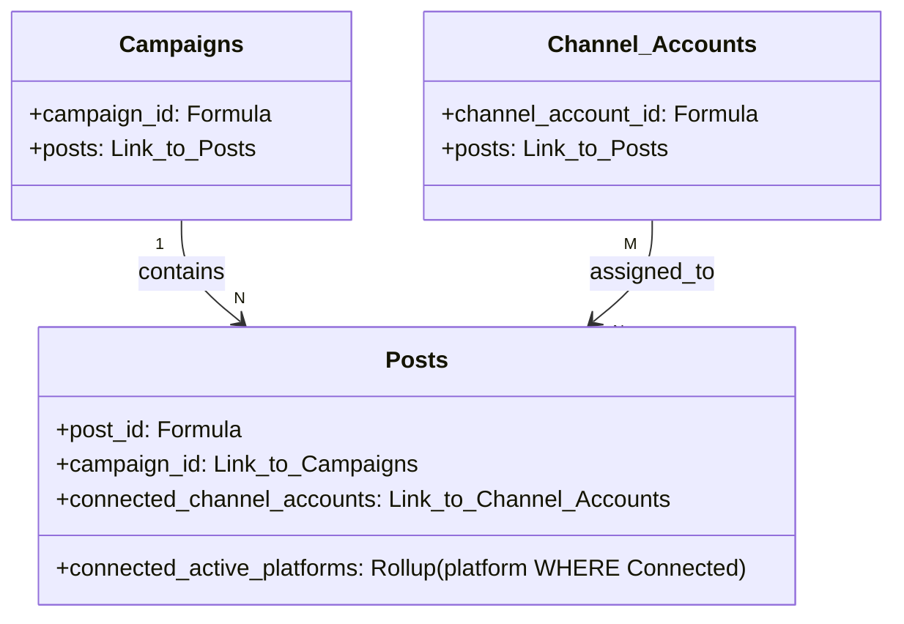

# US-001 Field Types and Constraints

**Date:** 2026-05-20  
**Task:** T-003: Field Types and Constraints  
**User Story:** US-001 — Thiết lập Airtable base cho campaign/post workflow  
**Status:** Completed  
**Author:** Database Architect Agent  

---

## 2. Docs Read

Quy trình thiết kế kiểu dữ liệu và ràng buộc vật lý (T-003) tuân thủ nghiêm ngặt các tài liệu của dự án:

| Độ ưu tiên | Tài liệu | Nội dung ràng buộc & thiết kế được trích xuất |
|:---|:---|:---|
| **P0** | [US-001-airtable-data-model.md](file:///d:/Muti-Media%20Management/docs/plans/US-001-airtable-data-model.md) | Kế thừa mô hình dữ liệu logic gồm 3 bảng `Campaigns`, `Posts`, `Channel Accounts` stub, quan hệ thực thể, và cấu hình tối giản không dùng Attachment. |
| **P0** | [US-001-scope-lock.md](file:///d:/Muti-Media%20Management/docs/plans/US-001-scope-lock.md) | Khóa chặt danh sách bảng, 6 trạng thái bắt buộc của Post, 3 quy tắc nghiệp vụ BR1-BR3, cấm phình scope sang Webhook/Automation/AI. |
| **P0** | [PLAN-us-001-airtable-base.md](file:///d:/Muti-Media%20Management/docs/plans/PLAN-us-001-airtable-base.md) | Sơ đồ phụ thuộc T-003 là đầu vào trực tiếp cho Thiết kế giao diện (T-004) và Cấu hình Guardrails (T-005). |
| **P0** | [06_Architecture_Composability.md](file:///d:/Muti-Media%20Management/docs/architecture/06_Architecture_Composability.md) | Định vị Airtable chỉ thuộc Control Plane; cấm lưu trữ token nhạy cảm, audit log hay runtime queue trong Airtable. |
| **P0** | [11_Coding_Convention.md](file:///d:/Muti-Media%20Management/docs/architecture/11_Coding_Convention.md) | Quy định bảo mật dữ liệu nhạy cảm (§5): Không chứa raw token trong Airtable base hay audit metadata. |
| **P1** | [04_Product_Backlog.md](file:///d:/Muti-Media%20Management/docs/requirements/04_Product_Backlog.md) | AC1-AC4 và BR1-BR3 của US-001 làm cơ sở thiết kế các trường công thức và kiểm duyệt. |
| **P1** | [05_Function_Flow_Logic_Register.md](file:///d:/Muti-Media%20Management/docs/requirements/05_Function_Flow_Logic_Register.md) | Luồng FL-001 webhook receiver thuộc US-002; chỉ định Record ID làm khóa idempotency duy nhất. |

---

## 3. Design Summary

Bản thiết kế cấu hình vật lý này hiện thực hóa mô hình dữ liệu logic bằng các kiểu dữ liệu Airtable tối ưu nhất, chú trọng vào **tính an toàn dữ liệu**, **khả năng mở rộng động (extensibility)** và **bảo toàn tính trung thực (integrity)** ở tầng cơ sở dữ liệu:

1. **Khóa Timezone tuyệt đối (Timezone Lock)**: Toàn bộ các trường kiểu Date/Date-Time (`scheduled_at`, `approved_at`, `start_date`, `end_date`) được bật cấu hình đồng bộ múi giờ **UTC/GMT** cho tất cả người dùng. Việc này đảm bảo tính nhất quán 100% khi Middleware và Queue Worker (RabbitMQ) xử lý các tác vụ lên lịch đăng bài theo giờ quốc tế.
2. **Kiểm duyệt nền tảng động (Generalized Platform Verification - BR2)**: Thay vì thiết kế kiểm duyệt cứng cho riêng Facebook Page, chúng tôi xây dựng cơ chế đối soát động thông qua trường **Conditional Rollup** `connected_active_platforms` kết hợp với tập hợp công thức so khớp từng nền tảng (`is_[platform]_check_passed`). Giải pháp này giải quyết triệt để yêu cầu kiểm duyệt đa kênh, sẵn sàng mở rộng sang LinkedIn, Twitter/X, Zalo, YouTube trong tương lai mà không cần cấu trúc lại bảng.
3. **Cờ hiệu trạng thái thông minh (Smart Status Flags)**: Thiết kế sẵn các trường công thức logic đóng vai trò là "nguyên liệu đầu vào" cho tầng bảo vệ (T-005 Guardrails). Trường `approval_blockers` sẽ tự động tổng hợp danh sách các lỗi vi phạm BR1-BR3 dưới dạng văn bản trực quan để hiển thị trực tiếp cho người dùng trên giao diện Grid/Interface.
4. **Bảo mật tuyệt đối thông tin nhạy cảm**: Tuyệt đối không chứa bất kỳ trường nào có tên hoặc chức năng lưu trữ `token`, `secret`, `credentials` nhằm tuân thủ nghiêm ngặt Coding Convention §5. Bảng `Channel Accounts` chỉ đóng vai trò là một Stub danh mục tham chiếu.

---

## 4. Airtable Field Type Conventions

Để đảm bảo cơ sở dữ liệu Airtable hoạt động ổn định và nhất quán cho toàn đội ngũ phát triển:

* **Tên trường (Naming)**: Sử dụng kiểu viết `snake_case` cho tất cả các trường hệ thống/API để Middleware dễ phân tích cú pháp. Đối với giao diện người dùng, T-004 có thể đặt nhãn hiển thị trực quan tương ứng.
* **Múi giờ (Timezone)**: Bắt buộc chọn `Use the same time zone (GMT/UTC) for all collaborators` đối với mọi trường ngày giờ.
* **Định dạng giờ**: Sử dụng định dạng 24 giờ (`24-hour clock`) cho các trường Date-time để tránh nhầm lẫn AM/PM.
* **Plain Text vs Rich Text**: Trường `master_copy` sử dụng Plain Text để tránh phát sinh định dạng markdown/HTML không mong muốn khi MCP Facebook gửi bài đăng lên Graph API.
* **Asset Storage**: Sử dụng trường Long Text (`asset_links`), mỗi URL đặt trên một dòng độc lập. Tuyệt đối không dùng Attachment field để giữ cơ sở dữ liệu nhẹ và tránh vượt quá hạn mức dung lượng của Airtable Base.

---

## 5. Campaigns Field Type Matrix

Bảng `Campaigns` quản lý thông tin chiến dịch marketing cấp cao.

| Trường (Field) | Kiểu dữ liệu Airtable (Physical Type) | Bắt buộc (Required) | Giá trị mặc định (Default) | Cấu hình / Công thức (Options / Formula) | Ghi chú kỹ thuật (Technical Notes) |
|:---|:---|:---|:---|:---|:---|
| `Autonumber` | Autonumber | Yes | Auto-increment | - | Trường ẩn, dùng làm helper để tạo ID duy nhất. |
| `campaign_id` | Formula | Yes | - | `"CMP-" & {Autonumber}` | **Primary Field** (Trường hiển thị chính, bắt buộc đặt ở cột đầu tiên). Định danh chiến dịch. |
| `name` | Single line text | Yes | - | - | Tên chiến dịch quảng cáo. |
| `objective` | Long text | No | - | Plain text | Mục tiêu chiến dịch. |
| `start_date` | Date | Yes | - | GMT/UTC, YYYY-MM-DD | Ngày bắt đầu chạy chiến dịch. |
| `end_date` | Date | Yes | - | GMT/UTC, YYYY-MM-DD | Ngày kết thúc chiến dịch. Phải `>= start_date`. |
| `owner` | User (Collaborator) | Yes | Current User | - | Người sở hữu chiến dịch. |
| `status` | Single select | Yes | `"Draft"` | `Draft`, `Active`, `Paused`, `Completed` | Trạng thái hoạt động của chiến dịch. |
| `notion_brief_url` | URL | No | - | - | Đường dẫn tài liệu brief trên Notion (Chỉ tham chiếu). |
| `posts` | Link to Posts | No | - | Allow linking to multiple records | Mối quan hệ một-nhiều (1-N) đảo ngược tới bảng `Posts`. |

---

## 6. Posts Field Type Matrix

Bảng `Posts` quản lý nội dung chi tiết, lịch đăng và trạng thái phê duyệt của từng bài đăng.

| Trường (Field)               | Kiểu dữ liệu Airtable (Physical Type) | Bắt buộc (Required) | Giá trị mặc định (Default) | Cấu hình / Công thức (Options / Formula)                          | Ghi chú kỹ thuật (Technical Notes)                                                    |
| :--------------------------- | :------------------------------------ | :------------------ | :------------------------- | :---------------------------------------------------------------- | :------------------------------------------------------------------------------------ |
| `Autonumber`                 | Autonumber                            | Yes                 | Auto-increment             | -                                                                 | Trường ẩn, dùng làm helper để tạo ID duy nhất.                                        |
| `post_id`                    | Formula                               | Yes                 | -                          | `"PST-" & {Autonumber}`                                           | **Primary Field** (Trường hiển thị chính, cột đầu tiên). Định danh bài đăng duy nhất. |
| `campaign_id`                | Link to Campaigns                     | Yes                 | -                          | Single record selection                                           | Mối quan hệ nhiều-một (Many-to-1) trỏ sang bảng `Campaigns`.                          |
| `title`                      | Single line text                      | Yes                 | -                          | -                                                                 | Tiêu đề bài đăng phục vụ quản lý nội bộ.                                              |
| `master_copy`                | Long text                             | Cond.               | -                          | Plain text (Rich text disabled)                                   | Nội dung cốt lõi của bài viết. Bắt buộc có dữ liệu khi status khác `Draft` (BR1).     |
| `cta_url`                    | URL                                   | No                  | -                          | -                                                                 | Link hành động đính kèm bài viết (chứa UTM).                                          |
| `asset_links`                | Long text                             | No                  | -                          | Plain text                                                        | Danh sách link media, mỗi dòng chứa một URL.                                          |
| `target_channels`            | Multiple select                       | Yes                 | `"Facebook"`               | `Facebook`, `LinkedIn`\*, `Twitter/X`\*, `YouTube`\*, `Zalo`\*    | Kênh đăng bài. Những kênh đánh dấu (\*) là proposed cho tương lai.                    |
| `connected_channel_accounts` | Link to Channel Accounts              | Cond.               | -                          | Allow linking to multiple records                                 | Liên kết tài khoản stub mạng xã hội cụ thể. Bắt buộc khi chuyển trạng thái duyệt.     |
| `scheduled_at`               | Date-Time                             | Cond.               | -                          | GMT/UTC, format 24h                                               | Lịch phát sóng. Bắt buộc ở tương lai khi chuyển trạng thái duyệt (BR3).               |
| `status`                     | Single select                         | Yes                 | `"Draft"`                  | `Draft`, `Review`, `Approved`, `Scheduled`, `Published`, `Failed` | Đúng 6 trạng thái bắt buộc theo AC2.                                                  |
| `reviewer`                   | User (Collaborator)                   | No                  | -                          | -                                                                 | Người chịu trách nhiệm kiểm duyệt/phê duyệt.                                          |
| `approved_at`                | Date-Time                             | No                  | -                          | GMT/UTC, format 24h                                               | Thời điểm duyệt thực tế. Cập nhật qua Automation (T-005) hoặc API.                    |

---

## 7. Channel Accounts Field Type Matrix

Bảng stub tham chiếu danh sách các tài khoản hoặc trang mạng xã hội đã liên kết.

| Trường (Field)       | Kiểu dữ liệu Airtable (Physical Type) | Bắt buộc (Required) | Giá trị mặc định (Default) | Cấu hình / Công thức (Options / Formula)                       | Ghi chú kỹ thuật (Technical Notes)                                                      |
| :------------------- | :------------------------------------ | :------------------ | :------------------------- | :------------------------------------------------------------- | :-------------------------------------------------------------------------------------- |
| `platform`           | Single select                         | Yes                 | `"Facebook"`               | `Facebook`, `LinkedIn`\*, `Twitter/X`\*, `YouTube`\*, `Zalo`\* | Hệ điều hành nền tảng mạng xã hội. Kênh (\*) là proposed cho tương lai.                 |
| `display_name`       | Single line text                      | Yes                 | -                          | -                                                              | Tên hiển thị công khai (ví dụ tên Page).                                                |
| `channel_account_id` | Formula                               | Yes                 | -                          | `{platform} & ": " & {display_name}`                           | **Primary Field** (Trường hiển thị chính, cột đầu tiên). Định danh duy nhất thân thiện. |
| `status`             | Single select                         | Yes                 | `"Connected"`              | `Connected`, `Disconnected`, `Expired`                         | Trạng thái kết nối của tài khoản.                                                       |
| `posts`              | Link to Posts                         | No                  | -                          | Allow linking to multiple records                              | Mối quan hệ Nhiều-Nhiều (Many-to-Many) đảo ngược tới bảng `Posts`.                      |

> [!WARNING]
> **Ràng buộc an toàn tuyệt đối**: Bảng `Channel Accounts` chỉ là Stub tham chiếu hiển thị. Nghiêm cấm tạo bất kỳ trường nào chứa mã truy cập bí mật như `access_token`, `refresh_token`, `secret`, `secret_ref` hay `oauth_credential` tại đây. Toàn bộ thông tin bảo mật thực tế phải được lưu trữ server-side tại Secret Storage của server tích hợp (Coding Convention §5).

---

## 8. Select Options Registry

Bảng đăng ký chi tiết các giá trị lựa chọn (Select values) để các Agent tiếp theo cấu hình đồng bộ:

### Campaigns Table
* **`status`**:
  * `Draft`: Chiến dịch đang được lập kế hoạch/soạn thảo.
  * `Active`: Chiến dịch đang chạy hoạt động.
  * `Paused`: Chiến dịch tạm ngưng hoạt động.
  * `Completed`: Chiến dịch đã hoàn thành chu kỳ.

### Posts Table
* **`status`** *(Bắt buộc đúng chính tả theo US-001 AC2)*:
  * `Draft`: Người sáng tạo đang soạn thảo nội dung.
  * `Review`: Bài viết đã sẵn sàng chờ SMM/Manager kiểm duyệt.
  * `Approved`: Đã phê duyệt, sẵn sàng để Middleware tiếp nhận tạo AI variant và publish job.
  * `Scheduled`: Đã lên lịch phát sóng (ghi nhận từ MCP server sau khi xếp hàng chờ đăng).
  * `Published`: Đăng tải thành công lên mạng xã hội.
  * `Failed`: Đăng tải thất bại (có ghi nhận lỗi cụ thể).
* **`target_channels`** *(Multi-select)*:
  * `Facebook` *(Bắt buộc hỗ trợ ban đầu)*
  * `LinkedIn` *(Proposed)*
  * `Twitter/X` *(Proposed)*
  * `YouTube` *(Proposed)*
  * `Zalo` *(Proposed)*

### Channel Accounts Table
* **`platform`** *(Single-select)*:
  * `Facebook` *(Bắt buộc)*
  * `LinkedIn` *(Proposed)*
  * `Twitter/X` *(Proposed)*
  * `YouTube` *(Proposed)*
  * `Zalo` *(Proposed)*
* **`status`** *(Single-select)*:
  * `Connected`: Tài khoản đang hoạt động bình thường.
  * `Disconnected`: Người dùng chủ động ngắt kết nối.
  * `Expired`: Token kết nối hết hạn, yêu cầu kết nối lại.

---

## 9. Linked Record / Lookup / Rollup Setup

Để thực hiện kiểm duyệt tự động BR1-BR3 tại tầng database mà không dùng code, chúng tôi thiết lập hệ thống quan hệ thực thể liên kết và Rollup như sau:



### Chi tiết cấu hình các trường liên kết & Rollup:

1. **`Posts.campaign_id`** trỏ sang **`Campaigns`**:
   * Kiểu: Linked Record.
   * Ràng buộc: Chỉ cho phép chọn duy nhất 1 chiến dịch (`Allow linking to multiple records = OFF`).
   * Mục đích: Gắn cứng bài đăng vào một chiến dịch.

2. **`Posts.connected_channel_accounts`** trỏ sang **`Channel Accounts`**:
   * Kiểu: Linked Record.
   * Ràng buộc: Cho phép chọn nhiều tài khoản liên kết (`Allow linking to multiple records = ON`).
   * Mục đích: Hỗ trợ đăng bài đa Page cùng lúc (Ví dụ: đăng lên 2 trang Facebook Page khác nhau).

3. **`Posts.connected_active_platforms`** *(Rollup đặc biệt cho BR2)*:
   * Quan hệ liên kết: `connected_channel_accounts`
   * Trường dữ liệu cuộn (Rollup field): `platform`
   * Điều kiện lọc (Conditional Rollup): Chỉ bao gồm các bản ghi từ bảng `Channel Accounts` thỏa mãn điều kiện `status = "Connected"`.
   * Công thức cuộn (Rollup formula): `ARRAYJOIN(values, ",")`
   * Mục đích: Lấy ra danh sách các nền tảng của tài khoản đã kết nối và đang ở trạng thái hoạt động bình thường dưới dạng chuỗi văn bản (ví dụ: `"Facebook,LinkedIn"`).

---

## 10. Formula Fields Recommended

Để phục vụ kiểm duyệt tự động các quy tắc nghiệp vụ BR1-BR3, dưới đây là danh sách các trường công thức (Formula fields) được khuyến nghị cấu hình chi tiết trên bảng **`Posts`**:

### A. Nhóm kiểm tra từng nền tảng phục vụ BR2 động:
Các trường này kiểm tra xem nếu kênh đích được chọn trong `target_channels` thì tài khoản liên kết hoạt động tương ứng đã có hay chưa.

1. **`is_facebook_check_passed`**
   * **Mô tả:** Kiểm tra kết nối tài khoản Facebook Page.
   * **Công thức (Formula):**
     ```excel
     IF(NOT(FIND("Facebook", {target_channels})), 1, IF(FIND("Facebook", {connected_active_platforms}), 1, 0))
     ```

2. **`is_linkedin_check_passed`**
   * **Mô tả:** Kiểm tra kết nối tài khoản LinkedIn.
   * **Công thức (Formula):**
     ```excel
     IF(NOT(FIND("LinkedIn", {target_channels})), 1, IF(FIND("LinkedIn", {connected_active_platforms}), 1, 0))
     ```

3. **`is_twitter_check_passed`**
   * **Mô tả:** Kiểm tra kết nối tài khoản Twitter/X.
   * **Công thức (Formula):**
     ```excel
     IF(NOT(FIND("Twitter/X", {target_channels})), 1, IF(FIND("Twitter/X", {connected_active_platforms}), 1, 0))
     ```

4. **`is_zalo_check_passed`**
   * **Mô tả:** Kiểm tra kết nối tài khoản Zalo.
   * **Công thức (Formula):**
     ```excel
     IF(NOT(FIND("Zalo", {target_channels})), 1, IF(FIND("Zalo", {connected_active_platforms}), 1, 0))
     ```

5. **`is_youtube_check_passed`**
   * **Mô tả:** Kiểm tra kết nối tài khoản YouTube.
   * **Công thức (Formula):**
     ```excel
     IF(NOT(FIND("YouTube", {target_channels})), 1, IF(FIND("YouTube", {connected_active_platforms}), 1, 0))
     ```

### B. Nhóm kiểm duyệt nghiệp vụ tổng hợp (BR1 - BR3):

6. **`has_connected_channel_accounts`** *(Tổng hợp kiểm duyệt BR2 động)*
   * **Mô tả:** Kiểm tra xem toàn bộ các kênh được lựa chọn trong `target_channels` đều đã được liên kết với ít nhất một tài khoản kết nối đang ở trạng thái hoạt động bình thường.
   * **Công thức (Formula):**
     ```excel
     IF(AND({is_facebook_check_passed}, {is_linkedin_check_passed}, {is_twitter_check_passed}, {is_zalo_check_passed}, {is_youtube_check_passed}), 1, 0)
     ```

7. **`is_master_copy_present`** *(Phục vụ BR1)*
   * **Mô tả:** Kiểm tra nội dung bài đăng không được trống.
   * **Công thức (Formula):**
     ```excel
     IF({master_copy} != "", 1, 0)
     ```

8. **`is_scheduled_in_future`** *(Phục vụ BR3)*
   * **Mô tả:** Kiểm tra xem thời điểm lên lịch đăng bài có ở trong tương lai so với thời điểm thực tế hiện tại hay không.
   * **Công thức (Formula):**
     ```excel
     IF(AND({scheduled_at}, IS_AFTER({scheduled_at}, NOW())), 1, 0)
     ```

9. **`is_valid_for_approval`** *(Tổng hợp tính hợp lệ phê duyệt)*
   * **Mô tả:** Bài đăng chỉ hợp lệ để duyệt khi vượt qua toàn bộ 3 quy tắc BR1, BR2 và BR3.
   * **Công thức (Formula):**
     ```excel
     IF(AND({is_master_copy_present}, {has_connected_channel_accounts}, {is_scheduled_in_future}), 1, 0)
     ```

10. **`approval_blockers`** *(Tổng hợp thông điệp lỗi trực quan)*
    * **Mô tả:** Trả về danh sách chuỗi văn bản chỉ rõ các lỗi vi phạm nghiệp vụ để hiển thị lên giao diện người dùng, hỗ trợ việc phát hiện lỗi tức thời.
    * **Công thức (Formula):**
      ```excel
      TRIM(
        IF(NOT({is_master_copy_present}), "❌ Thiếu nội dung Master Copy; ", "") & 
        IF(NOT({has_connected_channel_accounts}), "❌ Thiếu tài khoản kết nối hoạt động cho kênh đích; ", "") & 
        IF(NOT({is_scheduled_in_future}), "❌ Lịch đăng scheduled_at phải ở tương lai; ", "")
      )
      ```

---

## 11. Conditional Required Rules

Vì Airtable không hỗ trợ từ khóa ràng buộc `NOT NULL` động khi thay đổi trạng thái theo giao diện bảng Grid thông thường, cơ sở dữ liệu sẽ định nghĩa các quy tắc ràng buộc có điều kiện (Conditional Required Rules) như sau để các Agent phía sau cấu hình trên Interface Form hoặc Automation:

1. **Khi `status = "Review"` hoặc `status = "Approved"` hoặc `status = "Scheduled"`**:
   * **`master_copy`**: Bắt buộc phải có nội dung (`is_master_copy_present = 1`).
   * **`connected_channel_accounts`**: Bắt buộc phải liên kết ít nhất 1 tài khoản stub.
   * **`scheduled_at`**: Bắt buộc phải được điền và phải ở trong tương lai (`is_scheduled_in_future = 1`).
   * **`has_connected_channel_accounts`**: Phải bằng `1` (Đã cấu hình đủ tài khoản hoạt động cho tất cả các kênh được chọn).

2. **Khi `status = "Draft"`**:
   * Không bắt buộc các trường `master_copy`, `connected_channel_accounts`, `scheduled_at` phải có dữ liệu, tạo không gian thoải mái cho Creator soạn thảo nháp.

---

## 12. Validation Notes for T-005

Gửi **Security Auditor / Governance Reviewer** thực hiện **T-005 (Approval Guardrails)**:

* **Hành vi kiểm duyệt**: Tầng cấu hình trường database (T-003) đã cung cấp đầy đủ các trường cờ hiệu thông minh (`is_valid_for_approval`, `approval_blockers`).
* **Đề xuất Guardrail trên Interface**: Khi người dùng thao tác trên Airtable Interface, hãy ẩn nút chuyển trạng thái sang `Approved` hoặc cấu hình nó ở dạng Read-only nếu trường `is_valid_for_approval = 0`. Đồng thời, hiển thị trực quan trường văn bản `approval_blockers` nổi bật màu đỏ để cảnh báo người dùng.
* **Đề xuất Guardrail trên Automation**: Thiết lập một Airtable Automation chạy khi `status` được cập nhật sang `Approved`:
  * *Điều kiện kích hoạt:* `status = "Approved"` AND `is_valid_for_approval = 0` (Phát hiện chuyển trạng thái lỗi bất hợp pháp).
  * *Hành động xử lý:*
    1. Revert trạng thái `status` quay trở lại `Review` (hoặc `Draft`).
    2. Cập nhật một trường ghi chú hệ thống hoặc gửi thông báo trực tiếp qua giao diện thông báo lỗi để nhắc nhở người phê duyệt sửa lại dữ liệu bị thiếu.

---

## 13. View Inputs for T-004

Gửi **Operations Designer** thực hiện **T-004 (Workflow Views)**:

Bản thiết kế kiểu dữ liệu vật lý này cung cấp các trường lọc chính xác cho các View nghiệp vụ sau:

1. **`Needs Review` (Grid View)**:
   * *Bộ lọc (Filter):* `status = "Review"`
   * *Trường hiển thị ưu tiên:* `post_id`, `campaign_id`, `title`, `master_copy`, `target_channels`, `scheduled_at`, `approval_blockers`.
2. **`Approved Handoff` (Grid View)**:
   * *Bộ lọc (Filter):* `status = "Approved"` AND `is_valid_for_approval = 1`
   * *Mục đích:* Đây là View lọc sạch dữ liệu nhất dành riêng cho Middleware của US-002 quét hoặc nhận trigger. Việc lọc thêm điều kiện `is_valid_for_approval = 1` đóng vai trò là chốt chặn an toàn thứ hai, đảm bảo các bản ghi chuyển trạng thái lỗi bằng tay không bao giờ bị Middleware bắt nhầm để đem đi publish.
3. **`Calendar` (Calendar View)**:
   * *Trường ngày sử dụng làm lịch:* `scheduled_at`
   * *Cấu hình hiển thị nhãn:* `post_id` kết hợp với `title` và `status`.
4. **`Failed Posts` (Grid View)**:
   * *Bộ lọc (Filter):* `status = "Failed"`
   * *Trường hiển thị ưu tiên:* Gồm các lỗi đăng bài và lịch sử thao tác để SMM theo dõi xử lý.

---

## 14. Handoff Notes for T-006

Gửi **Backend Specialist** thực hiện **T-006 (Middleware Handoff Contract Stub)**:

* **Airtable Record ID**: Middleware của bạn khi nhận webhook hoặc quét View `Approved Handoff` phải sử dụng trường hệ thống mặc định **Airtable Record ID** (ví dụ: `recXXXXX`) làm khóa định danh bất biến cấp thấp để phục vụ truy vấn chi tiết API và đối soát trùng lặp (Idempotency Key) ở tầng Ledger/Middleware. Không tự sinh UUID mới trong Airtable Base.
* **Múi giờ**: Dữ liệu thời gian `scheduled_at` và `approved_at` gửi sang Middleware được cam kết định dạng theo chuỗi chuẩn ISO 8601 UTC (ví dụ: `2026-05-20T17:30:00.000Z`) nhờ vào cấu hình khóa cứng timezone ở T-003. Bạn hoàn toàn yên tâm phân tích cú pháp thời gian mà không lo lỗi lệch múi giờ cục bộ.
* **asset_links**: Dữ liệu gửi sang dạng văn bản nhiều dòng chứa các URLs phân tách bằng dấu xuống dòng (`\n`). Hãy xử lý cắt chuỗi (string split) để lấy mảng URLs phục vụ tải media.

---

## 15. Out-of-Scope Confirmations

Để chống phình scope (Scope Creep), Database Architect xác nhận các thành phần sau nằm hoàn toàn **ngoài phạm vi cấu hình** của T-003:

* **Không cấu hình Webhook**: Không tạo webhook URL tích hợp hay webhook receiver trong Airtable base ở bước này (thuộc T-006/US-002).
* **Không triển khai Automation**: Không dựng các kịch bản gửi tin Slack hay cập nhật tự động bằng code script trong Airtable ở nhiệm vụ này (thuộc T-005/T-006).
* **Không lưu trữ bí mật bảo mật**: Tuyệt đối không có bất kỳ trường nào chứa token, client_secret hay password trong cơ sở dữ liệu Airtable.
* **Không thiết kế các bảng chức năng khác**: Không dựng các bảng chứa log xử lý AI, bảng lưu bình luận của người dùng hay bảng log publish. Toàn bộ các bảng này thuộc về Postgres Operational Ledger.

---

## 16. Risks / Open Questions

| ID | Rủi ro / Vấn đề mở | Tác động | Giải pháp khắc phục ở tầng Database |
|:---|:---|:---|:---|
| **R-01** | Airtable không thể khóa cứng thay đổi trạng thái ở giao diện Grid thông thường. | Người dùng có thể vô tình chuyển `status` sang `Approved` bằng tay trên bảng Grid dù `is_valid_for_approval = 0`. | Cấu hình bộ lọc View `Approved Handoff` cực kỳ chặt chẽ: Chỉ hiển thị các bản ghi có `status = "Approved"` AND `is_valid_for_approval = 1`. Như vậy, các record vi phạm nghiệp vụ sẽ tự động bị ẩn khỏi View handoff và Middleware sẽ không bao giờ nhìn thấy hoặc xử lý chúng. |
| **R-02** | Trạng thái đồng bộ của các tài khoản Stub bị sai lệch so với Ledger thật. | Trường hợp tài khoản trong Ledger đã bị `Expired` hoặc `Disconnected` nhưng trong Airtable vẫn hiển thị `Connected`, dẫn đến việc vượt qua kiểm duyệt BR2 một cách sai trái. | Admin/IT cần đảm bảo thiết lập một luồng đồng bộ một chiều (One-way Sync) tự động từ Postgres Ledger sang bảng stub `Channel Accounts` của Airtable để cập nhật trạng thái kết nối ngay lập tức khi token hết hạn. |
| **Q-01** | Quyền hạn duyệt bài của các vai trò (Roles) trong thực tế. | Ảnh hưởng đến việc cấu hình trường `reviewer` và phân quyền bảo mật trên giao diện Interface ở T-004/T-005. | Đây là câu hỏi mở Q-005 của dự án. Tầng database cấu hình sẵn trường `reviewer` kiểu User (Collaborator) để sẵn sàng ánh xạ phân quyền trên Interface khi Product Owner đưa ra câu trả lời chính thức ở Sprint 1. |
