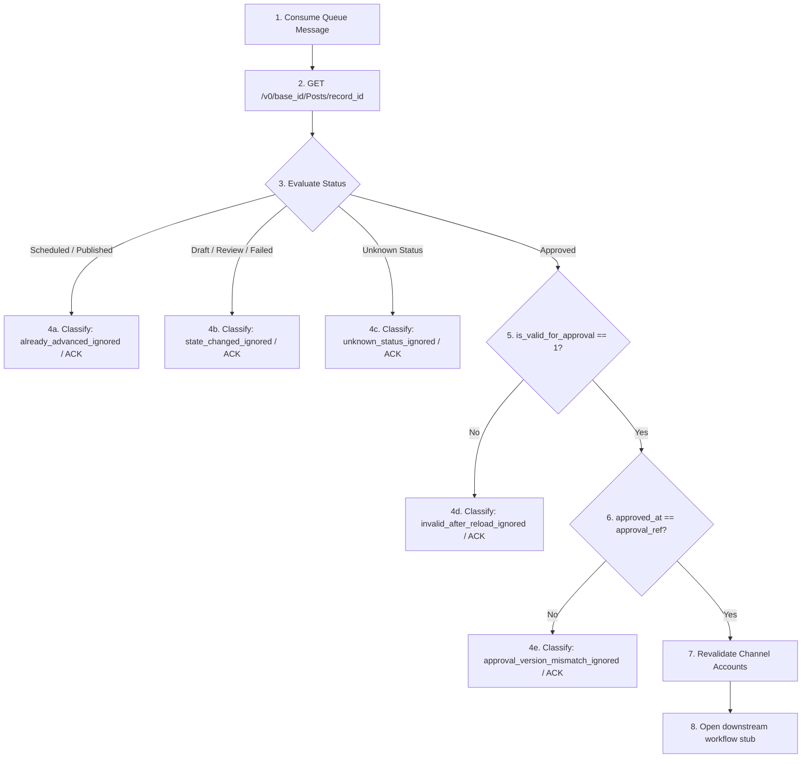

# AI-SDLC Retrofit Header for US-001

status: approved

## Goal

Maintain US-001 behavior for Airtable Campaign and Post Workflow Base according to the approved backlog, function flow, and implementation evidence.

## Tasks

- AC-001: Preserve the documented trigger, processing, and output workflow.
- AC-002: Preserve tenant isolation, idempotency, and durable Ledger/audit evidence where applicable.
- AC-003: Preserve zero-token and reference-only security boundaries.
- AC-004: Keep the story compatible with build, lint, tests, and AI-SDLC artifact validation.

## Done When

- AC-001: Story workflow matches the accepted implementation report and function flow register.
- AC-002: Ledger, idempotency, queue, and role/security constraints are documented or tested where applicable.
- AC-003: No raw tokens or oversized/raw provider payloads cross forbidden boundaries.
- AC-004: `npm run ai-sdlc:check -- US-001` passes after retrofit artifacts are present.

# US-001 Middleware Handoff Contract Stub

**Date:** 2026-05-20  
**Task:** T-006: Middleware Handoff Contract Stub  
**User Story:** US-001 — Thiết lập Airtable base cho campaign/post workflow  
**Status:** Completed  
**Author:** Backend Specialist & Security Auditor Agents  

---

## 1. Docs Read

This middleware handoff contract is fully aligned with the architectural constraints and operational rules defined in the following 12 project documents, analyzed in chronological order:

1. **P0** | [06_Architecture_Composability.md](file:///d:/Muti-Media%20Management/docs/architecture/06_Architecture_Composability.md) — Confirmed Airtable acts purely as a Control Plane (no queues, audit logs, or platform tokens).
2. **P0** | [11_Coding_Convention.md](file:///d:/Muti-Media%20Management/docs/architecture/11_Coding_Convention.md) — Extracted rules from Section 5: zero raw tokens in logs/Airtable/Slack, and references-only in RabbitMQ payloads.
3. **P0** | [PLAN-us-001-airtable-base.md](file:///d:/Muti-Media%20Management/docs/plans/PLAN-us-001-airtable-base.md) — Aligned with T-006 task definition, RACI matrix, and dependency graphs.
4. **P0** | [US-001-scope-lock.md](file:///d:/Muti-Media%20Management/docs/plans/US-001-scope-lock.md) — Extracted out-of-scope boundaries (e.g., no active TS webhook code in US-001).
5. **P0** | [US-001-airtable-data-model.md](file:///d:/Muti-Media%20Management/docs/plans/US-001-airtable-data-model.md) — Aligned with logic models for campaigns, posts, and channel accounts.
6. **P0** | [US-001-field-types-and-constraints.md](file:///d:/Muti-Media%20Management/docs/plans/US-001-field-types-and-constraints.md) — Mapped physical field types, snake_case names, and formula-based validation logic.
7. **P0** | [US-001-workflow-views.md](file:///d:/Muti-Media%20Management/docs/plans/US-001-workflow-views.md) — Mapped `Approved Handoff` view filter logic (`status = Approved` AND `is_valid_for_approval = 1`) and the exception lane.
8. **P1** | [04_Product_Backlog.md](file:///d:/Muti-Media%20Management/docs/requirements/04_Product_Backlog.md) — Audited Epic E01, US-001, US-002, and Epic E06 (RabbitMQ/Unified Inbox) criteria.
9. **P1** | [05_Function_Flow_Logic_Register.md](file:///d:/Muti-Media%20Management/docs/requirements/05_Function_Flow_Logic_Register.md) — Reviewed FL-001 (Airtable Post Approved Webhook) and FL-008 (RabbitMQ Event Bus).
10. **P2** | [07_Risk_Assumption_Decision_Log.md](file:///d:/Muti-Media%20Management/docs/project-mgmt/07_Risk_Assumption_Decision_Log.md) — Factored in risks R-005 (token leakage) and security gate constraints.
11. **P2** | [12_Notion_Workspace_Spec.md](file:///d:/Muti-Media%20Management/docs/architecture/12_Notion_Workspace_Spec.md) — Verified Notion is used strictly for contextual briefs via reference URLs.
12. **P2** | [03_SRS_MediaOps_Composability.md](file:///d:/Muti-Media%20Management/docs/requirements/03_SRS_MediaOps_Composability.md) — Verified Non-Functional Requirements (NFR) on performance, rate limits, and fail-closed security.

---

## 2. Design Summary

The T-006 Middleware Handoff Contract establishes a **Zero-Trust Integration Boundary** between the Airtable Control Plane (US-001) and the Downstream Orchestration Middleware (US-002 / FL-001). 

Rather than treating the incoming webhook payload as an execution order, the middleware operates on a **Pull-and-Verify Model**. 
Events are mere signals notifying the middleware that a state change occurred. The middleware MUST reload the entire record from the Airtable API by `record_id` and revalidate all constraints against the current database state before initiating any side effects. This model prevents race conditions, stale event processing, and malicious payload tempering.

Furthermore, to maintain strict security, the integration is governed by the **References-Only Queue Principle**. Large post bodies, image files, and authorization credentials are kept entirely out of RabbitMQ. Instead, the message payload carries only immutable identifiers, forcing workers to resolve context and retrieve server-side credentials via Postgres and Secure Secret Storage.

---

## 3. Source View Contract

The middleware is permitted to interact with and query **ONLY** one specific view within the `Posts` table. No other view is exposed.

### Table A: Source View Contract Spec
| Item | Value | Notes |
|:---|:---|:---|
| **Source Table** | `Posts` | The primary operational table in the Airtable base. |
| **Source View** | `Approved Handoff` | The official **Clean Lane** designed for automated consumption. |
| **Allowed Query Path** | `GET /v0/{base_id}/Posts?view=Approved+Handoff` | Downstream middleware must query this view or configure its webhook receiver triggers strictly restricted to this view. |
| **Primary Filter Rules** | `status = Approved` AND `is_valid_for_approval = 1` | Airtable automatically filters out incomplete, invalid, or obsolete drafts. |
| **Sorting** | `scheduled_at` Ascending | Middleware consumes posts starting from the earliest scheduled. |
| **Handoff Mode** | Read-Only for Payload, Write-Only for State Updates | Middleware only reads the record, never edits content. It may update `status` to `Scheduled`, `Published`, or `Failed` downstream (future US-002+ behavior, not implemented in US-001). |

---

## 4. Handoff Eligibility Rules

A post is only eligible to cross the boundary into the middleware lane if it passes all physical database constraints and is exposed in the `Approved Handoff` view. The eligibility formula is:

```text
status = Approved AND is_valid_for_approval = 1
```

Where `is_valid_for_approval` is a calculated formula field checking:
1. `is_master_copy_present = 1` (The `master_copy` long text field is not empty, satisfying **BR1**).
2. `has_connected_channel_accounts = 1` (All channels specified in the multi-select `target_channels` have a corresponding linked reference stub in `connected_channel_accounts` that is in `Connected` status, satisfying **BR2**).
3. `is_scheduled_in_future = 1` (The `scheduled_at` timestamp is strictly greater than the current time `NOW()`, satisfying **BR3**).

If any of these conditions fail, `is_valid_for_approval` evaluates to `0`, automatically excluding the post from the `Approved Handoff` view and routing it to the `Invalid Approved / Approval Blocked` view.

---

## 5. Minimal Event Payload

When the Airtable webhook fires on a post status update, the initial payload sent to the webhook receiver MUST remain minimal to minimize exposure and data transfer.

### Table B: Minimal Event Payload Schema
| Field | Required | Physical Type | Source | Purpose | Allowed in Queue? |
|:---|:---|:---|:---|:---|:---|
| `event_id` | Yes | String (UUID) | Webhook Header / Generator | Tracing and correlation. | Yes |
| `record_id` | Yes | String (`recXXXX`) | Airtable System | The primary record key to reload the data. | **Yes (Reference)** |
| `table_name` | Yes | String (`Posts`) | Airtable System | Specifies which table is affected. | Yes |
| `change_type` | Yes | String (`update`) | Airtable System | Webhook event operation type. | Yes |
| `approved_at` | Yes | String (ISO 8601) | Airtable System | Timestamp when the record was approved. | Yes |
| `master_copy` | No | Long Text | Airtable Field | Raw post content. | **NO (Security/Size Block)** |
| `cta_url` | No | URL | Airtable Field | Raw CTA. | **NO (Size Block)** |
| `asset_links` | No | Long Text | Airtable Field | Raw asset file links. | **NO (Size Block)** |
| `access_token` | No | String | Airtable Field | Page credentials. | **NO (Strict Security Ban)** |

---

## 6. References-Only Queue Message Stub

After receiving and verifying the webhook, the receiver enqueues a message into the RabbitMQ queue (`airtable.webhook.approved`). This message contains **immutable references only**.

### Table C: Queue Message Stub Properties
| Property | Type | Description |
|:---|:---|:---|
| `event_type` | String | Static descriptor (`airtable.post.approved`). |
| `source` | String | Originating subsystem (`airtable.webhook_receiver`). |
| `record_ref` | String | Immutable Airtable Record ID (`recXXXXX`). |
| `approval_ref` | String | Verification timestamp (`approved_at` in ISO 8601 format). Acts as a temporary deduplication hint. |
| `routing_ref` | Array | List of target platform strings (e.g., `["Facebook"]`) extracted during reload. |

### Precise JSON Block Specification:
```json
{
  "event_type": "airtable.post.approved",
  "source": "airtable.webhook_receiver",
  "record_ref": "rec9t7W2uP0YxL8e9",
  "approval_ref": "2026-05-20T07:45:00.000Z",
  "routing_ref": [
    "Facebook"
  ]
}
```

---

## 7. Dedupe / Idempotency Hint

The architecture implements a transition path between US-001 (Airtable-centric MVP) and US-002 (Production Postgres Ledger).

> [!WARNING]
> **PRODUCTION IDEMPOTENCY KEY CONSTRAINT (DF-003):**
> 1. The composite key `record_id + approved_at` is PURELY a temporary US-001/T-006 integration/testing deduplication hint. It is STRICTLY BANNED for production ledger usage (US-002+).
> 2. The true production ledger idempotency key MUST be `record_id + approved_version`.
> 3. The `approved_version` sequence MUST be managed and persisted entirely server-side (Postgres Ledger).
> 4. DO NOT add an `approved_version` field to the Airtable Base schema during US-001. Adding it violates the Control Plane boundaries.

### Transitional Deduplication Hint (US-001 / T-006):
* **Idempotency Composite:** `record_id + approved_at`
* **Rationale:** Because the US-001 Airtable schema is kept clean and minimalist, it does not define a persistent, server-generated `approved_version` field. The `approved_at` ISO 8601 timestamp serves as the temporary version indicator.
* **Constraints:** This composite is strictly valid for **T-006 contract/documentation stubs and basic integration tests**. It must never be treated as the final, long-term ledger idempotency key.

### Final Idempotency Contract (US-002 onwards):
* **Idempotency Composite:** `record_id + approved_version`
* **Ledger Management:** The `approved_version` is an integer generated and maintained entirely server-side within the Operational Ledger (Postgres), NOT in Airtable.
* **Airtable Zero-Poll Rule:** Do NOT add `approved_version` as a field in Airtable during US-001. Airtable remains a Control Plane; persistent database versioning belongs to the Postgres Operational Ledger.
* **Ledger Deduplication:** For each incoming webhook event, the Ledger increments the local `approved_version` upon a fresh, verified reload. If an event is received with an `approved_at` matching a previously processed ledger state, it is rejected as a duplicate and ACK'd without duplicate queue enqueuing. If the reloaded Airtable record has already advanced to `Scheduled` or `Published`, classify it as `already_advanced_ignored`; if it has moved back to `Draft`, `Review`, or `Failed`, classify it as `state_changed_ignored`.

---

## 8. Middleware Reload Strategy

When a worker consumes the references-only queue message, it MUST NOT trust the payload. The worker must execute the following systematic **Reload and Reverify Strategy**:



### Steps:
1. **Fetch Latest State:** Call the Airtable API `GET /v0/{base_id}/Posts/{record_id}` to retrieve the absolute fresh snapshot of the record.
2. **Evaluate Current Status:**
   - **Approved:** Continue revalidation (proceed to Step 3).
   - **Scheduled / Published:** Already processed by another worker. Immediately classify the transaction as `already_advanced_ignored`, write a sanitized note to the Ledger, and **ACK the event** (no workflow created, no duplicate enqueued, no retry).
   - **Draft / Review / Failed:** Status was reverted or moved back before processing. Immediately classify as `state_changed_ignored`, write a sanitized note, and **ACK the event** (no workflow, no retry).
   - **Any Unknown Status:** Unrecognized or empty status value. Fail closed, classify as `unknown_status_ignored`, and **ACK the event** (no workflow, no retry).
3. **Revalidate Eligibility:** Verify that `is_valid_for_approval` is equal to `1`. If not, classify as `invalid_after_reload_ignored`, write validation errors to the Ledger, and **ACK the event** (no workflow, no retry).
4. **Revalidate Timestamp:** Verify that the reloaded `approved_at` matches the event's `approval_ref` (or dedupe hint). If not, classify as `approval_version_mismatch_ignored`, write mismatch reasons, and **ACK the event** (no workflow, no retry).

---

## 9. Validation Expectations

During the reload phase, the middleware validates the physical fields against the following logical rules before enqueuing to downstreams:

1. **`master_copy` Check:**
   - Must be present (length > 0) and not contain placeholder characters (e.g., `[Insert Copy Here]`).
   - Treated strictly as plain text (no markdown parsing or HTML stripping at this boundary).
2. **`scheduled_at` Check:**
   - Must be structured in ISO 8601 UTC format.
   - Must be strictly in the future relative to the server's current timestamp (`NOW()`).
3. **`target_channels` & `connected_channel_accounts` Check:**
   - Extract the linked channel account reference stubs.
   - Cross-check that every platform selected in `target_channels` has a corresponding record in the linked accounts array.

---

## 10. Error Handling Stub

The middleware classifies validation failures into distinct ledger statuses to guarantee robust telemetry and error isolation without blocking queues.

### Table D: Webhook and State Validation Error Matrix
| Case | Detection | Action | Ledger Status | Retry? |
|:---|:---|:---|:---|:---|
| **Already Advanced Approved Event** | Reloaded status is `Scheduled` or `Published` | ACK event; log sanitized note; do not create workflow or publish job. | `already_advanced_ignored` | No |
| **State Changed After Approval** | Reloaded status is `Draft`, `Review`, or `Failed` | ACK event; log sanitized note; do not create workflow. | `state_changed_ignored` | No |
| **Unknown Status on Reload** | Reloaded status is unrecognized or empty | ACK event; log warning; fail closed; do not create workflow. | `unknown_status_ignored` | No |
| **Approval Version Mismatch** | Reloaded `approved_at` differs from event `approval_ref` | Terminate flow; log mismatch; ACK event. | `approval_version_mismatch_ignored` | No |
| **Record No Longer Valid** | Reloaded `is_valid_for_approval != 1` | Terminate flow; log validation errors; ACK event. | `invalid_after_reload_ignored` | No |
| **Missing Channel Account** | `target_channels` includes `Facebook` but `connected_channel_accounts` is empty | Terminate flow; log sanitized reason; ACK event. | `channel_account_missing` | No |
| **Inactive Channel Account** | Linked Facebook Page stub status is `Disconnected` or `Expired` | Terminate flow; log inactive alert; ACK event. | `channel_account_inactive` | No |
| **Channel Account Unresolved** | Airtable account stub ID cannot be mapped to server-side DB page ID | Fail closed; block publish; write sanitized Ledger reason; NACK with `requeue=false` (if DLQ exists) else ACK + Ledger exception. | `channel_account_unresolved` | No |
| **Temporary Airtable Failure** | Airtable API returns `503 Service Unavailable` or `429 Rate Limit` | Trigger backoff schedule; retry up to 5 times. | `retryable_failed` | **Yes (Exponential Backoff)** |

### Unified ACK/NACK and DLQ Resolution Policy (DF-002):

To prevent queue blockages and ensure robust administrative triage, the following unified error handling policy is established:

1. **Obsolete/Stale & Business-Invalid Events:**
   - Any event that is reloaded and verified as obsolete or invalid (`already_advanced_ignored`, `state_changed_ignored`, `unknown_status_ignored`, `approval_version_mismatch_ignored`, `invalid_after_reload_ignored`, `channel_account_missing`, `channel_account_inactive`) represents a resolved or unrecoverable business state.
   - The middleware MUST write the transaction to the Ledger audit log and **ACK (Acknowledge) the event** to gracefully remove it from the active queue.

2. **Unresolved Channel Accounts (`channel_account_unresolved`):**
   - Occurs when an Airtable account stub ID cannot be mapped to a server-side PostgreSQL Page ID (e.g., deleted or renamed stub).
   - The middleware MUST fail closed, block publish operations, skip MCP server calls, and write a sanitized error reason to the Ledger.
   - **Queue Mechanics:**
     - *If a Dead Letter Queue (DLQ) is configured (US-002 / US-014):* The middleware issues a **NACK (Negative Acknowledgment) with `requeue=false`** to route the event directly to the DLQ exchange for administrative inspection.
     - *If no DLQ is configured:* The middleware MUST **ACK the original event** to prevent queue congestion, and immediately create a separate admin-visible exception record or trigger an alert event in the Ledger database.
     - *Note on Scope:* The physical configuration and deployment of DLQ routing, DLQ exchanges, and RabbitMQ dead-letter bindings are downstream implementation details under US-002/US-014, and are not physically deployed in US-001.

---

## 11. Security and Privacy Constraints

Security is maintained via a strict credential boundary, protecting long-lived access tokens from ever touching the Control Plane.

```text
  [ Airtable Control Plane ]
             │
             │ (Display Stub Reference Only: "Facebook: MediaOps Page")
             ▼
  [ Orchestration Middleware ]
             │
             │ (Resolves Reference to UUID in Secure Storage)
             ▼
  [ Secret Storage / Ledger DB ] ──► (Loads Decrypted Page Access Token) ──► [ Meta Graph API ]
```

### A. Credential Boundary:
* **Reference Only:** The Airtable field `connected_channel_accounts` contains only display stubs (e.g., `Facebook: MediaOps Page`).
* **Zero Token Rule:** The middleware MUST NEVER expect, request, or parse access tokens, refresh tokens, App Secrets, or secret keys from Airtable. 
* **Server-Side Resolution:** The middleware resolves the display reference to secure, server-side credential materials stored in Postgres (via Secret Storage/Vault) using RLS-isolated queries.
* **Fail Closed:** If no secure server-side credential can be resolved for the active stub reference, the event is classified as `channel_account_unresolved`, blocked from publishing, and routed according to the DLQ/ACK exception mechanics (DLQ routing if configured, otherwise ACK with ledger exception).

### B. Logging and Audit Constraints:
* **Credential Masking:** Webhook receivers, middleware logs, RabbitMQ queues, and Operational Ledger metadata MUST NOT write raw platform tokens, Slack signatures, or decrypted secret material. 
* **Sanitized Logs:** If validation fails (e.g., missing account), the ledger logs a sanitized warning (`channel_account_missing`), stripping out any internal database schema details or folder paths.

---

## 12. Boundary With US-002 (Webhook Receiver)

* **US-001/T-006 Scope:** Defines the metadata contract, the reload validation strategy, and error stubs.
* **US-002 Scope:** Implements the actual Webhook Receiver endpoint, sets up the physical RabbitMQ queues/exchanges, writes the TypeScript logic for the reload queries, and initializes the Postgres Ledger schemas for `webhook_event` and `audit_log`.

---

## 13. Boundary With US-005/US-006 (Facebook MCP)

* **Decoupled Architecture:** Downstream workers do not make direct Meta Graph API calls.
* **MCP Tool Boundary:** Workers communicate with Meta platforms strictly through Facebook MCP tools (`validate_post`, `enqueue_publish`, `publish_post`), keeping all API-specific complexities and token storage isolated within the Execution Plane.

---

## 14. Handoff Notes for T-007 QA

To verify this handoff contract stub during the T-007 QA phase:

1. **Verify Filter Integrity:** Ensure that changing a post's status to `Approved` while leaving `master_copy` blank keeps the record excluded from the `Approved Handoff` view.
2. **Verify Event Ingestion Simulation:** Test with a mock webhook payload containing only the references (`record_ref`, `approval_ref`). Verify that the mock receiver rejects attempts to inject raw copy or assets into the queue payload.
3. **Verify Stale Race Condition Mocking:** Simulate a stale race condition where the queue message is processed after a post's status is changed from `Approved` back to `Review`. Verify that the mock worker reloads the record, detects the status change, classifies it as `state_changed_ignored`, writes the audit ledger entry, and gracefully ACKs the event.

---

## 15. Out-of-Scope Confirmations

To prevent scope creep, the following components are officially out of scope for T-006:
* **No TypeScript Code:** No server, webhook receiver, or routing code is written.
* **No Active Queue Configurations:** No RabbitMQ exchanges, routing keys, or DLQs are physically deployed (belongs to US-002/US-014).
* **No Secret Storage setups:** No Postgres database tables or vault integrations are configured (belongs to US-002/US-011).

---

## 16. Risks / Open Questions

| ID | Technical/Operational Risk | Impact | Handoff Mitigation |
|:---|:---|:---|:---|
| **TR-01** | High frequency of status changes in Airtable causes API rate limits during reloads. | Webhook receiver fails to reload data, leading to publishing delays. | The middleware implements a 5-attempt exponential backoff retry policy for `retryable_failed` events triggered by Airtable `429 Too Many Requests`. |
| **TR-02** | Facebook Page stub reference in Airtable is renamed by an administrator, breaking resolution. | The server fails to map the renamed stub to the server-side UUID, causing publish failures. | Classify as `channel_account_unresolved` in the ledger, fail closed, skip MCP calls, and immediately trigger an admin-visible Ledger alert for manual correction. |
| **TR-03** | Webhook delivery is delayed, resulting in a post being published after its `scheduled_at` date. | Content goes live late, causing misalignment in campaign scheduling. | Revalidation expectation: If `scheduled_at` is in the past during reload, the middleware rejects it as `invalid_after_reload_ignored` and prompts manual rescheduling. |

---
