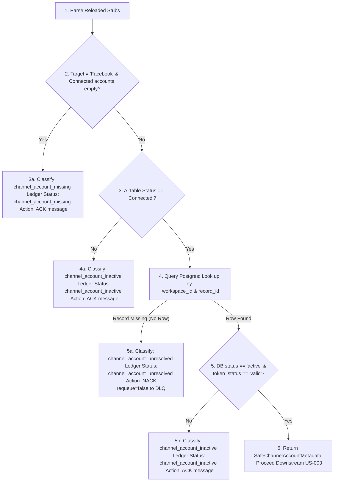

# AI-SDLC Retrofit Header for US-002

status: approved

## Goal

Maintain US-002 behavior for Airtable Approved Webhook Workflow Trigger according to the approved backlog, function flow, and implementation evidence.

## Tasks

- AC-001: Preserve the documented trigger, processing, and output workflow.
- AC-002: Preserve tenant isolation, idempotency, and durable Ledger/audit evidence where applicable.
- AC-003: Preserve zero-token and reference-only security boundaries.
- AC-004: Keep the story compatible with build, lint, tests, and AI-SDLC artifact validation.

## Done When

- AC-001: Story workflow matches the accepted implementation report and function flow register.
- AC-002: Ledger, idempotency, queue, and role/security constraints are documented or tested where applicable.
- AC-003: No raw tokens or oversized/raw provider payloads cross forbidden boundaries.
- AC-004: `npm run ai-sdlc:check -- US-002` passes after retrofit artifacts are present.

# US-002 Channel Account Resolution Boundary

## 1. Docs Read

This technical design document is fully aligned with the architectural constraints and operational rules defined in the following 16 project documents, analyzed in chronological order:

1. **P0** | [06_Architecture_Composability.md](file:///d:/Muti-Media%20Management/docs/architecture/06_Architecture_Composability.md) — Confirmed Airtable acts strictly as a Control Plane; middleware owns webhook/reload/idempotency; RabbitMQ is the asynchronous queue; Postgres is the durable Operational Ledger.
2. **P0** | [11_Coding_Convention.md](file:///d:/Muti-Media%20Management/docs/architecture/11_Coding_Convention.md) — Enforced TS conventions, references-only queue messages, Zero Token Logging in files/audit/Slack, and the strict requirement that workers acknowledge messages *only* after durable database transactions commit.
3. **P1** | [04_Product_Backlog.md](file:///d:/Muti-Media%20Management/docs/requirements/04_Product_Backlog.md) — Audited AC1-AC4 for Approved webhooks and ledger mappings, plus BR2 requiring linked page connections for target channels.
4. **P1** | [05_Function_Flow_Logic_Register.md](file:///d:/Muti-Media%20Management/docs/requirements/05_Function_Flow_Logic_Register.md) — Incorporated the complete `FL-001` revalidation logic, states, and error handling matrix.
5. **P2** | [07_Risk_Assumption_Decision_Log.md](file:///d:/Muti-Media%20Management/docs/project-mgmt/07_Risk_Assumption_Decision_Log.md) — Integrated decision `D-003` (durable SQL ledger) and risk mitigation for token leakage.
6. **P2** | [03_SRS_MediaOps_Composability.md](file:///d:/Muti-Media%20Management/docs/requirements/03_SRS_MediaOps_Composability.md) — Adhered to Non-Functional Requirements (NFR) for strict data boundary isolation and fail-closed security.
7. **P2** | [13_Sprint_1_Backlog.md](file:///d:/Muti-Media%20Management/docs/requirements/13_Sprint_1_Backlog.md) — Maintained scope alignment within the boundaries of Sprint 1.
8. **P0** | [US-001-final-implementation-notes.md](file:///d:/Muti-Media%20Management/docs/plans/US-001/US-001-final-implementation-notes.md) — Verified the physical Airtable schemas and custom field configurations.
9. **P0** | [US-001-middleware-handoff-contract.md](file:///d:/Muti-Media%20Management/docs/plans/US-001/US-001-middleware-handoff-contract.md) — Adopted the references-only messaging contract and zero-trust pull-and-verify model.
10. **P0** | [PLAN-us-002-airtable-approved-webhook.md](file:///d:/Muti-Media%20Management/docs/plans/US-002/PLAN-us-002-airtable-approved-webhook.md) — Aligned with the high-level task breakdown, scheduling boundaries, and dependencies for T-008.
11. **P0** | [US-002-scope-lock.md](file:///d:/Muti-Media%20Management/docs/plans/US-002/US-002-scope-lock.md) — Confirmed out-of-scope boundaries (e.g., no active AI generation or platform publishing under US-002).
12. **P0** | [US-002-ledger-schema-and-idempotency.md](file:///d:/Muti-Media%20Management/docs/plans/US-002/US-002-ledger-schema-and-idempotency.md) — Extended Postgres ledger definitions, transaction lifecycle, and index layouts.
13. **P0** | [US-002-shared-event-and-ledger-contracts.md](file:///d:/Muti-Media%20Management/docs/plans/US-002/US-002-shared-event-and-ledger-contracts.md) — Adopted the shared TypeScript contracts and taxonomy structures.
14. **P0** | [US-002-webhook-receiver-api-design.md](file:///d:/Muti-Media%20Management/docs/plans/US-002/US-002-webhook-receiver-api-design.md) — Synced with webhook receiver data flow.
15. **P0** | [US-002-rabbitmq-topology-approved-post.md](file:///d:/Muti-Media%20Management/docs/plans/US-002/US-002-rabbitmq-topology-approved-post.md) — Verified the routing exchange, staged retries, and dead-letter queues.
16. **P0** | [US-002-approved-post-worker-reload-reverify.md](file:///d:/Muti-Media%20Management/docs/plans/US-002/US-002-approved-post-worker-reload-reverify.md) — Mapped T-007 revalidation rules, transaction boundaries, and state classification logic.

**Spawner Skills Applied Silently:**
- `~/.spawner/skills/data/postgres-wizard/` (Covering indexes, composite constraints, and transaction block isolation)
- `~/.spawner/skills/ai-agents/agent-tool-builder/` (Clear contract boundary and loose coupling)
- `.agent/agents/database-architect.md` (Strict data integrity, proper typing, index placement)
- `.agent/agents/security-auditor.md` (Zero-trust design, secret containment, fail-closed semantics)

---

## 2. Boundary Objective

The primary objective of the **Channel Account Resolution Boundary (T-008)** is to establish a secure, token-free interface that translates administrative channel references managed in the Airtable Control Plane into verified database structures within the Postgres Operational Ledger.

In a composable architecture, social media platform credentials (such as page access tokens and secrets) represent highly sensitive assets. Storing them in Airtable violates security baselines, while passing them through RabbitMQ messages introduces massive vulnerability surfaces. Therefore:
1. Airtable holds *strictly* token-free display stubs (`platform`, `display_name`, `status`, and record IDs).
2. The middleware worker reloads these display stubs from Airtable and delegates them to the resolver boundary.
3. The resolver maps the administrative references to secure, local database rows in Postgres.
4. The resolver returns *only* sanitized, safe metadata for orchestrating downstream AI content compilation. 

This boundary acts as a strict guardrail, completely isolating sensitive cryptographic credentials and token lifetimes from both the Airtable Control Plane and active worker message paths.

---

## 3. Scope

### In Scope
- Designing the secure TypeScript interface and resolver contract.
- Mapping the physical input stubs from Airtable to server-side Postgres metadata.
- Designing the database lookup and indexing strategy to ensure sub-millisecond query execution.
- Defining the strict classification rules for `channel_account_missing`, `channel_account_inactive`, and `channel_account_unresolved` states.
- Defining fail-closed behaviors to block downstream publishing if the resolution is uncertain.
- Creating the transaction mapping and RabbitMQ ACK/NACK routing rules for each classification outcome.

### Out of Scope (strictly deferred to US-011 / US-005)
- Loading raw access tokens, refresh tokens, or app secrets at this boundary.
- Decrypting platform credentials or requesting secrets from vault storage.
- Calling the Facebook MCP Server (`validate_post`, `publish_post`, etc.) or Meta Graph API.
- Initiating any real social media post publication.
- Designing or implementing the OAuth redirection, token storage, and credential validation mechanics (which belong entirely to **US-011**).

---

## 4. Airtable Stub Inputs

When the worker reloads a Post record from Airtable, it receives target channels and linked channel account references. The physical fields in the Airtable reload payload are defined as follows:

```json
{
  "id": "recPost9t7W2uP0Yx",
  "fields": {
    "title": "SMM Promo Post",
    "target_channels": ["Facebook"],
    "connected_channel_accounts": [
      "recAcc8z9Y2uP0YxL9"
    ]
  }
}
```

If the worker follows up to reload the linked `connected_channel_accounts` record from the base to fetch the display stubs, it receives the following token-free administrative structure:

```json
{
  "id": "recAcc8z9Y2uP0YxL9",
  "fields": {
    "platform": "Facebook",
    "display_name": "SMM Page",
    "status": "Connected"
  }
}
```

### Consolidated Input Structure
The resolver accepts the following normalized array of administrative display stubs extracted during worker reload:

```ts
type AirtableAccountStub = {
  airtable_channel_account_record_id: string; // The physical Airtable Record ID (e.g., 'recAcc8z9Y2uP0YxL9')
  platform: string;                           // The platform name (e.g., 'Facebook')
  display_name: string;                       // Administrative name (e.g., 'SMM Page')
  status: "Connected" | "Disconnected" | "Expired" | string; // Control Plane status
};
```

---

## 5. Server-side Metadata Contract

The resolver is strictly prohibited from returning credentials. It acts as a projection layer that returns a clean, sanitized metadata record upon successful lookup.

### TypeScript Contract:
```ts
export interface SafeChannelAccountMetadata {
  workspace_id: string;
  platform: "Facebook";
  airtable_channel_account_record_id: string; // Airtable key mapping
  channel_account_id: string;                 // Server-side Postgres UUID
  external_account_id?: string;               // Meta Page ID (e.g., '1029384756')
  display_name: string;                       // Clean display name
  status: "connected";                        // Verified active operational state
  token_status?: "valid" | "expired" | "missing" | "unknown"; // Safe health state
}
```

### Strict Security Banned Payload List
Under no circumstances may the resolver query, extract, load, or return any of the following fields:
- `access_token` (Long-lived or short-lived Facebook Page tokens)
- `refresh_token` (Platform refresh tokens)
- `app_secret` (Meta app client secret)
- `secret_ref` (Opaque reference strings pointing to vaults, e.g., `vault://secret/fb_token_1`)
- `decrypted_credential` (Any raw decrypted string)
- `oauth_payload` (Original JSON structure from platform OAuth responses)

---

## 6. Resolver Flow

The resolver operates as a fail-closed pipeline to evaluate the eligibility of the administrative stub against the operational ledger:



---

## 7. Classification Matrix

The resolver categorizes all outcomes into strict taxonomies mapping directly to transaction boundaries and broker actions:

| Case | Target Condition | Resolved Taxonomy | Broker Action | DLQ? | Version Allocated? | Ledger Status | Rationale |
|:---|:---|:---|:---:|:---:|:---:|:---|:---|
| **A** | `target_channels` includes `"Facebook"` but `connected_channel_accounts` is empty. | `channel_account_missing` | **ACK** | No | No | `channel_account_missing` | A resolved business-invalid state. ACKing prevents queue blockage; generates alert `TR-02` in Ledger. |
| **B** | Linked Airtable stub exists but status is `"Disconnected"`, `"Expired"`, or inactive. | `channel_account_inactive` | **ACK** | No | No | `channel_account_inactive` | Clear administrative signal that page is offline. ACKing avoids queue clogging; alerts admin. |
| **C** | Linked stub cannot map to any server-side Postgres metadata (record deleted or renamed). | `channel_account_unresolved` | **NACK** (`requeue=false`) | **Yes** | No | `channel_account_unresolved` | Critical synchronization discrepancy between Control Plane and Ledger. Enqueues to DLQ for triage. |
| **D** | Linked stub exists, mapped in DB, but DB status is `'inactive'` or token is expired. | `channel_account_inactive` | **ACK** | No | No | `channel_account_inactive` | Token expired or account paused server-side. ACKing is safe; alerts SMM. |
| **E** | Valid mapping: DB row is `'active'` and token health is `'valid'`. | *Success* | **ACK** (At end of flow) | No | **Yes** | `workflow_stub_created` | Safe metadata returned; proceeds to generate version, write workflow stub, and commit. |

*Fallback Rule for Case C:* If the Dead Letter Queue (DLQ) is temporarily inactive or unavailable during setup, the worker MUST **ACK** the broker message to prevent queue backlogs and immediately throw a critical, admin-visible ledger exception record.

---

## 8. Security and Privacy Rules

To protect cryptographic secrets and ensure compliance with security audits:
1. **Never Load Tokens:** The database resolver query MUST select only non-sensitive columns (`id`, `workspace_id`, `platform`, `airtable_channel_account_record_id`, `external_account_id`, `display_name`, `status`, `token_status`). It must never select `secret_ref` or raw credential values.
2. **Zero Credentials in Logs:** Under no circumstances may access tokens, refresh tokens, secrets, or decrypted materials be written to standard output, console logs, file logs, Slack alerts, or database audit trails.
3. **Log Sanitization:** Error strings captured during resolution failures (e.g., database lookup errors) must be stripped of file system directories, database server ports, connection credentials, and trace stack logs before being persisted to the `webhook_events.error_message` column.
4. **Row-Level Security (RLS) Compliance:** Every query issued to resolve account stubs MUST explicitly filter on `workspace_id` to comply with future RLS policies, preventing cross-tenant information disclosure.

---

## 9. Database Lookup Strategy

### 9.1 Database Schema Context
The server-side operational ledger contains the `channel_accounts` structure defining Page registrations:

```sql
CREATE TABLE channel_accounts (
  id UUID PRIMARY KEY DEFAULT gen_random_uuid(),
  workspace_id TEXT NOT NULL,
  platform TEXT NOT NULL,
  airtable_channel_account_record_id TEXT NOT NULL,
  external_account_id TEXT NOT NULL,
  display_name TEXT NOT NULL,
  status TEXT NOT NULL DEFAULT 'active', -- 'active', 'inactive'
  token_status TEXT NOT NULL DEFAULT 'unknown', -- 'valid', 'expired', 'missing', 'unknown'
  secret_ref TEXT NOT NULL, -- Secret vault locator, e.g., 'vault://fb_token_rec123'
  connected_at TIMESTAMPTZ NOT NULL DEFAULT NOW(),
  updated_at TIMESTAMPTZ NOT NULL DEFAULT NOW(),
  CONSTRAINT channel_accounts_airtable_record_uq UNIQUE (workspace_id, airtable_channel_account_record_id)
);
```

### 9.2 High-Performance Indexing Design
To guarantee sub-millisecond retrieval under high production volume and avoid sequential table scans, a unique composite B-tree index is constructed:

```sql
CREATE UNIQUE INDEX CONCURRENTLY channel_accounts_lookup_idx
  ON channel_accounts (workspace_id, airtable_channel_account_record_id)
  INCLUDE (id, platform, external_account_id, display_name, status, token_status);
```

**Why this index strategy is highly optimized:**
- **Concurrency:** Built using `CONCURRENTLY` to avoid write lock contention on the active ledger.
- **Selective Lookup:** Matches the query search criteria exactly: `workspace_id` and `airtable_channel_account_record_id`.
- **Index-Only Scan (Covering Index):** By using `INCLUDE`, the query planner fetches all required metadata columns directly from the index tree nodes, completely eliminating expensive heap memory fetches to the physical table blocks.

### 9.3 Safe Resolver SQL Query Pattern
```sql
SELECT 
  id,
  workspace_id,
  platform,
  airtable_channel_account_record_id,
  external_account_id,
  display_name,
  status,
  token_status
FROM channel_accounts
WHERE workspace_id = $1
  AND airtable_channel_account_record_id = $2
  AND platform = 'Facebook'
LIMIT 1;
```

*Security Audit Note:* The selection list is explicit and strictly excludes `secret_ref`.

---

## 10. Failure Handling

Resolution failures represent critical decision points that must be managed without losing message processing stability:

### 10.1 `channel_account_unresolved` DLQ Path
When the resolver returns `channel_account_unresolved` (Airtable stub is missing from the local Postgres ledger):
1. **DB Transaction:** Write the terminal state to Postgres:
   ```sql
   UPDATE webhook_events 
   SET status = 'channel_account_unresolved',
       error_code = 'ERR_CHANNEL_UNRESOLVED',
       error_message = 'Airtable account stub rec123 cannot be resolved server-side.'
   WHERE event_id = $1;
   ```
2. **Audit Logging:** Append an entry to `audit_logs` identifying the failed resolution.
3. **Commit:** Commit the SQL transaction.
4. **Queue Action (Broker NACK):** Send a negative acknowledgment `basic.nack(requeue=false)` to the broker. The message is automatically routed to the dead-letter exchange `airtable.webhook.approved.dlq` for administrator investigation and manual sync repair.

### 10.2 Fallback ACK Strategy (No DLQ Active)
If the DLQ exchange is not physically configured or is unreachable:
1. **DB Transaction:** Update status to `channel_account_unresolved`, write error logs, and append the audit trail.
2. **Commit:** Commit the transaction.
3. **Queue Action (Broker ACK):** Send `basic.ack` to remove the message from the queue, preventing broker saturation.
4. **Administrative Alerting:** Write a critical operational exception record to the database ledger (e.g., generating an administrative alert flag `TR-02` in a separate schema view) to ensure visibility on operations dashboards.

---

## 11. Test Scenarios

The integration boundary must be verified using the following mock test scenarios:

### SC-T08-01: Valid Channel Resolution
- **Input Mock:** Inbound stub has `airtable_channel_account_record_id = 'recAcc01'`, status = `'Connected'`.
- **Database State:** Row exists with matching record ID, status = `'active'`, token_status = `'valid'`.
- **Expected Outcome:** Resolver returns a success result with `SafeChannelAccountMetadata` matching the TypeScript contract. Downstream processing proceeds.

### SC-T08-02: Target Channel Missing Stubs
- **Input Mock:** `target_channels = ["Facebook"]` but reloaded `connected_channel_accounts` is empty.
- **Expected Outcome:** Resolver returns `channel_account_missing` mapping. Event is logged as `channel_account_missing`, transaction commits, broker receives **ACK**.

### SC-T08-03: Airtable Inactive Account Stub
- **Input Mock:** Inbound stub has status = `'Disconnected'` or `'Expired'` in Airtable.
- **Expected Outcome:** Resolver returns `channel_account_inactive`. Event logged, transaction commits, broker receives **ACK** (no database lookup triggered).

### SC-T08-04: Server-side Account Inactive or Expired
- **Input Mock:** Inbound stub has status = `'Connected'`.
- **Database State:** Matching row exists, but database `status = 'inactive'` or `token_status = 'expired'`.
- **Expected Outcome:** Resolver returns `channel_account_inactive`. Event logged, transaction commits, broker receives **ACK**.

### SC-T08-05: Missing Database Mapping (Unresolved Account)
- **Input Mock:** Inbound stub has status = `'Connected'`, but the database has no row matching `airtable_channel_account_record_id`.
- **Expected Outcome:** Resolver returns `channel_account_unresolved`. Event logged, transaction commits, broker receives **NACK** with `requeue=false` (routed to DLQ).

---

## 12. Verification Checklist

The implementation of the T-008 boundary is complete and correct only if it satisfies all of the following:

- [x] Detailed Safe resolver contract defined matching the `SafeChannelAccountMetadata` specification.
- [x] All raw credential fields (`access_token`, `refresh_token`, `app_secret`, `secret_ref`) are strictly banned and excluded from queries and returned payloads.
- [x] Clear classification matrix implemented mapping Missing $\rightarrow$ `channel_account_missing`, Inactive/Expired $\rightarrow$ `channel_account_inactive`, and Unmappable $\rightarrow$ `channel_account_unresolved`.
- [x] "Ledger Update before ACK/NACK" invariant strictly preserved.
- [x] Fail-closed behavior implemented: any unresolved or inactive account blocks downstream publish actions.
- [x] High-performance B-tree index `channel_accounts_lookup_idx` defined with `INCLUDE` clause for sub-millisecond index-only scans.
- [x] RLS compliance guaranteed: all database select queries include explicit `workspace_id` parameters.
- [x] Sanity logs strip out directories, connection strings, and system trace logs.
- [x] Complete set of mock test scenarios provided.

---

## 13. Open Questions / Risks

1. **Airtable Display Name Synchronicity:**
   - *Risk:* SMM administrators can rename account stubs inside Airtable, leading to mismatch warnings.
   - *Mitigation:* The resolver performs lookups exclusively using `airtable_channel_account_record_id` (the immutable record ID string, e.g. `'recAcc123'`), ignoring changes to the `display_name` text string.
2. **US-011 Handshake Integration:**
   - *Risk:* High latency between SMM setting up page connection in Airtable and the Admin completing OAuth connection server-side, causing false `channel_account_unresolved` DLQ routes.
   - *Mitigation:* SMM interface should keep status as `Disconnected` until US-011 completes the server-side OAuth step, which automatically transitions status in both Airtable and Postgres to `Connected` simultaneously.
3. **Multi-Channel Publishing in MVP:**
   - *Risk:* If a post targets both Facebook and another future platform, the failure of one platform's resolution could block the entire transaction (partial publication risk).
   - *Mitigation:* The MVP resolves all target channels atomically. If *any* target channel fails resolution, the resolver fails closed for all platforms, preventing orphaned cross-posts until multi-channel routing splits are introduced.
