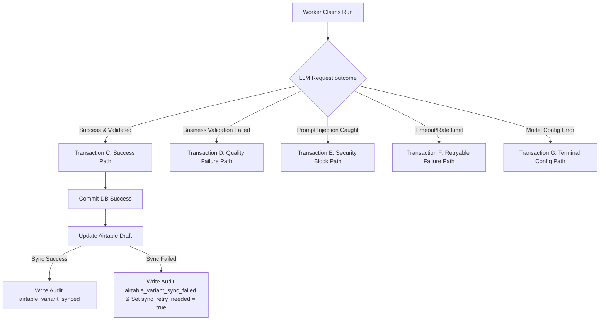

# AI-SDLC Retrofit Header for US-003

status: approved

## Goal

Maintain US-003 behavior for AI Composer Facebook Variant Generation according to the approved backlog, function flow, and implementation evidence.

## Tasks

- AC-001: Preserve the documented trigger, processing, and output workflow.
- AC-002: Preserve tenant isolation, idempotency, and durable Ledger/audit evidence where applicable.
- AC-003: Preserve zero-token and reference-only security boundaries.
- AC-004: Keep the story compatible with build, lint, tests, and AI-SDLC artifact validation.

## Done When

- AC-001: Story workflow matches the accepted implementation report and function flow register.
- AC-002: Ledger, idempotency, queue, and role/security constraints are documented or tested where applicable.
- AC-003: No raw tokens or oversized/raw provider payloads cross forbidden boundaries.
- AC-004: `npm run ai-sdlc:check -- US-003` passes after retrofit artifacts are present.

# US-003 / T-009: Variant Persistence and Airtable Update Design

## 1. Docs Read

This technical design document is fully integrated with the architectural constraints and operational rules defined in the following 13 project documents, analyzed in chronological order:

1. **P0** | [06_Architecture_Composability.md](file:///d:/Muti-Media%20Management/docs/architecture/06_Architecture_Composability.md) — Confirmed AI Composer belongs strictly to the Orchestration & AI Middleware layer; the AI Composer cannot directly execute Facebook Graph API commands. Direct platform interactions are isolated inside the MCP Execution Plane; Postgres is the Operational Ledger.
2. **P0** | [11_Coding_Convention.md](file:///d:/Muti-Media%20Management/docs/architecture/11_Coding_Convention.md) — Enforced TypeScript usage, shared contracts via `packages/shared-contracts`, Zero Token Logging, and worker ACK only after successful Ledger database commits.
3. **P1** | [04_Product_Backlog.md](file:///d:/Muti-Media%20Management/docs/requirements/04_Product_Backlog.md) — Aligned with Epic E02 (AI Orchestration) and US-003 (AI Composer Facebook Variant) AC1–AC4 and business rules BR1–BR3.
4. **P1** | [05_Function_Flow_Logic_Register.md](file:///d:/Muti-Media%20Management/docs/requirements/05_Function_Flow_Logic_Register.md) — Mapped out transitional states for `FL-002` (AI Composer) and `FL-001` (Airtable Post Approved Webhook).
5. **P2** | [PLAN-us-003-ai-composer-facebook-variant.md](file:///d:/Muti-Media%20Management/docs/plans/US-003/PLAN-us-003-ai-composer-facebook-variant.md) — Synced with the overall work-breakdown structure and task sequence of US-003.
6. **P2** | [US-003-scope-lock.md](file:///d:/Muti-Media%20Management/docs/plans/US-003/US-003-scope-lock.md) — Frozen scope definition for US-003 to prevent publish queue leakage.
7. **P2** | [US-003-ai-ledger-schema-and-idempotency.md](file:///d:/Muti-Media%20Management/docs/plans/US-003/US-003-ai-ledger-schema-and-idempotency.md) — Inherited schema definitions for `ai_generation_runs`, `content_variants`, custom enums, and indexing strategy.
8. **P2** | [US-003-shared-ai-contracts.md](file:///d:/Muti-Media%20Management/docs/plans/US-003/US-003-shared-ai-contracts.md) — Synced with TypeScript typings, `normalizeHashtags` and `validateCtaUtmMatch` helper contracts, and error structures.
9. **P2** | [US-003-ai-composer-worker-flow.md](file:///d:/Muti-Media%20Management/docs/plans/US-003/US-003-ai-composer-worker-flow.md) — Integrated RabbitMQ claims, row locks, and non-blocking ACK/NACK semantics.
10. **P2** | [US-003-context-loading-boundary.md](file:///d:/Muti-Media%20Management/docs/plans/US-003/US-003-context-loading-boundary.md) — Synced with zero-trust loading boundaries and fallback strategies.
11. **P2** | [US-003-prompt-template-and-versioning.md](file:///d:/Muti-Media%20Management/docs/plans/US-003/US-003-prompt-template-and-versioning.md) — Ensured alignment with prompt templates and security delimiters.
12. **P2** | [US-003-structured-output-validation.md](file:///d:/Muti-Media%20Management/docs/plans/US-003/US-003-structured-output-validation.md) — Decoupled Zod schema parsing and UTM/CTA preservation boundaries.
13. **P2** | [US-003-ai-provider-adapter-and-retry.md](file:///d:/Muti-Media%20Management/docs/plans/US-003/US-003-ai-provider-adapter-and-retry.md) — Handled request timeouts, exponential backoffs, and circuit breakers.

### Specialist Knowledge Applied:
* **`C:\Users\Hi\.spawner\skills\data\postgres-wizard\skill.yaml` & `sharp-edges.yaml`**: Designed transactional isolation blocks, row-level locks, and multi-tenant RLS checks with optimal indexes.
* **`C:\Users\Hi\.spawner\skills\backend\api-design\skill.yaml` & `sharp-edges.yaml`**: Defined error-handling taxonomy structures, soft mappings, and robust interface boundaries.
* **`C:\Users\Hi\.spawner\skills\backend\event-architect\skill.yaml` & `sharp-edges.yaml`**: Ensured event-driven state idempotency, audit trail tracking, and fail-safe transactional boundaries.

---

## 2. Objective

The primary objective of **US-003 / T-009** is to design the robust **Persistence and Airtable Update Specification** for the AI Composer Facebook Variant.

This specification maps the precise transaction boundaries in Postgres, updates the operational statuses, persists the active drafts in `content_variants`, performs soft-mapped Airtable draft syncs, implements compensation strategies when Airtable fails, and records audit logs—all while adhering to multi-tenant workspace isolation and strict token redaction boundaries.

This document serves as the high-fidelity design blueprint that enables downstream tasks to implement code cleanly and safely.

---

## 3. Persistence Scope

### In Scope
* Mapping the physical multi-branch Postgres transaction blocks (Success, Validation Failure, Security block, Retryable Failure, and Config Failure).
* Guaranteeing database transaction commits complete **before** initiating any external Airtable API calls (Database-First Boundary).
* Implementing the **Airtable Mapping Schema Config Block** to decouple database fields from physical Airtable columns via a soft-mapping configuration.
* Specifying **Airtable Failure Compensation** rules, leveraging the additive `sync_retry_needed` flag and a partial index for efficient background syncing.
* Preventing raw AI output or unvalidated content from being sent to Airtable or stored as active drafts.
* Registering a standardized **Audit Events Taxonomy** with precise structural payloads.
* Enforcing multi-tenant workspace isolation at the query level.
* Specifying error-handling compatibility across enums and schemas.

### Out of Scope
* Making actual runtime REST calls to Airtable or Postgres (spec-only phase).
* Making Facebook Graph API calls or enqueuing social media publish jobs.
* Mutating or overriding the approval status of variants to `'approved'` (bypassing SMM human checks is banned).
* Storing raw credentials, tokens, or Notion page body text in the database, Airtable, or logs.
* Creating new `publish_jobs` or publish queue entries (deferred to US-005).

---

## 4. Input Contracts

The persistence engine accepts inputs originating from upstream steps (**T-007 Validation** and **T-008 Adapter**):

1. **`StructuredComposerOutput` (Validated Output):**
   * `body`: string (validated composed copy, min length 10).
   * `hashtags`: string[] (deduplicated, normalized array of maximum 10 elements starting with `#`).
   * `cta_url`: string | undefined (clean URL with UTM parameters preserved; omitted when source has no CTA).
2. **`NotionContextRef[]`:**
   * Safe metadata references of documents processed (load status, fallbacks).
3. **`AiInputSnapshot`:**
   * Sanitized variables passed to the prompt template.
4. **`Provider Metadata` (Safe telemetry from T-008):**
   * `provider`: string (configured provider identifier).
   * `model`: string (configured model identifier).
   * `prompt_version`: string (active prompt registry version).
   * `latency_ms`: number.
   * `token_usage`: `AiTokenUsage` (prompt, completion, total).

---

## 5. Multi-Branch Transaction Lifecycles (Operational Ledger)

To maintain atomic consistency, the worker execution logic interacts with the database via distinct transactional blocks.



### 5.1. Transaction C: Happy Path (Success)
Committed atomically upon successful Zod parsing, hashtag normalization, and UTM validation:

```sql
BEGIN;

-- 1. Update the generation run status and outputs
UPDATE ai_generation_runs
SET status = 'completed',
    input_snapshot = $11,
    notion_context_refs = $12,
    output_snapshot = $1, -- Validated JSON output (contains body, hashtags, cta_url)
    provider = $13,
    model = $14,
    prompt_version = $15,
    completed_at = NOW(),
    error_code = NULL,
    error_message = NULL
WHERE id = $2 AND workspace_id = $3;

-- 2. Upsert content variant (ensure unique active draft per platform post)
INSERT INTO content_variants (
  workspace_id, ai_generation_run_id, workflow_run_id, airtable_record_id, post_id,
  platform, body, hashtags, cta_url, approval_status, policy_status, sync_retry_needed
) VALUES (
  $3, $2, $4, $5, $6, 'facebook', $7, $8, $9, 'needs_review', 'pending_policy', false
)
ON CONFLICT (workspace_id, workflow_run_id, platform)
DO UPDATE SET
  ai_generation_run_id = EXCLUDED.ai_generation_run_id,
  body = EXCLUDED.body,
  hashtags = EXCLUDED.hashtags,
  cta_url = EXCLUDED.cta_url,
  approval_status = 'needs_review', -- Enforce hard reset of review status on update
  policy_status = 'pending_policy',
  sync_retry_needed = false,
  created_at = NOW()
RETURNING id;

-- 3. Transition parent workflow run status
UPDATE workflow_runs
SET status = 'ai_generation_completed'
WHERE id = $4 AND workspace_id = $3;

-- 4. Record Audit Log
INSERT INTO audit_logs (workspace_id, actor_type, actor_id, action, entity_type, entity_id, metadata)
VALUES ($3, 'system', 'ai_composer_worker', 'ai_variant_persisted', 'content_variant', $10, 
        '{"approval_status": "needs_review", "policy_status": "pending_policy"}'::jsonb);

COMMIT;
```

### 5.2. Transaction D: Validation / Quality Failure Path
Triggered by validation exceptions such as `SCHEMA_PARSING_FAILED`, `CTA_UTM_MUTATED`, `INTENT_DRIFT`, `CTA_URL_INVALID`, or `CTA_URL_MISSING`.

> [!NOTE]
> The database preserves the run but prevents draft promotion:
> * `content_variants` is NOT updated (the last good draft or empty state remains active).
> * The run is sent to `needs_manual_review` for diagnostic tracking.

```sql
BEGIN;

-- 1. Mark run as needing manual review
UPDATE ai_generation_runs
SET status = 'needs_manual_review',
    output_snapshot = $1, -- Only save a sanitized partial structured output if available; never save raw unvalidated provider output
    completed_at = NOW(),
    error_code = $2, -- e.g. 'CTA_UTM_MUTATED'
    error_message = $3
WHERE id = $4 AND workspace_id = $5;

-- 2. Mark parent workflow run as failed
UPDATE workflow_runs
SET status = 'ai_generation_failed'
WHERE id = $6 AND workspace_id = $5;

-- 3. Record Audit Log
INSERT INTO audit_logs (workspace_id, actor_type, actor_id, action, entity_type, entity_id, metadata)
VALUES ($5, 'system', 'ai_composer_worker', 'ai_generation_validation_failed', 'ai_generation_run', $4,
        jsonb_build_object('error_code', $2, 'error_message', $3));

COMMIT;
```

### 5.3. Transaction E: Security Block Path (Prompt Injection)
Triggered by security signal scans (`PROMPT_INJECTION_DETECTED`).

> [!CAUTION]
> To prevent storage of malicious payloads or secondary exploits:
> * The output snapshot is **completely omitted** from the database and logs.
> * We save only a cryptographic hash of the raw response (`rawOutputHash`) for audit trail reference.
> * Flags an administrative alert.

```sql
BEGIN;

-- 1. Mark run as failed due to security breach
UPDATE ai_generation_runs
SET status = 'failed',
    output_snapshot = NULL,
    completed_at = NOW(),
    error_code = 'PROMPT_INJECTION_DETECTED',
    error_message = 'Security scanner intercepted an unauthorized prompt injection attempt.'
WHERE id = $1 AND workspace_id = $2;

-- 2. Mark parent workflow run as failed
UPDATE workflow_runs
SET status = 'ai_generation_failed'
WHERE id = $3 AND workspace_id = $2;

-- 3. Record Audit Log with critical alert flag
INSERT INTO audit_logs (workspace_id, actor_type, actor_id, action, entity_type, entity_id, metadata)
VALUES ($2, 'system', 'ai_composer_worker', 'ai_generation_failed', 'ai_generation_run', $1,
        '{"error_code": "PROMPT_INJECTION_DETECTED", "alert_needed": true}'::jsonb);

COMMIT;
```

### 5.4. Transaction F: Provider Retryable Failure Path
Triggered by temporary exceptions such as `PROVIDER_RATE_LIMIT`, `PROVIDER_TIMEOUT`, or `CONTEXT_UNREACHABLE`.

> [!IMPORTANT]
> To prevent CPU hot-loops or RabbitMQ thread starvation:
> * The parent workflow run is released back to `pending_ai_generation`.
> * The current queue delivery is **ACKed** after the Postgres commit succeeds.
> * An asynchronous backoff scheduler owns the subsequent retry attempt.

```sql
BEGIN;

-- 1. Mark run as retryable failed
UPDATE ai_generation_runs
SET status = 'retryable_failed',
    error_code = $1,
    error_message = $2
WHERE id = $3 AND workspace_id = $4;

-- 2. Release parent workflow run back to pool for scheduled retry
UPDATE workflow_runs
SET status = 'pending_ai_generation'
WHERE id = $5 AND workspace_id = $4;

-- 3. Record Audit Log
INSERT INTO audit_logs (workspace_id, actor_type, actor_id, action, entity_type, entity_id, metadata)
VALUES ($4, 'system', 'ai_composer_worker', 'ai_generation_retryable_failed', 'ai_generation_run', $3,
        jsonb_build_object('error_code', $1, 'retry_attempt', $6));

COMMIT;
```

### 5.5. Transaction G: Terminal Configuration Failure Path
Triggered by administrator setup errors (`INVALID_MODEL_CONFIG`).

```sql
BEGIN;

-- 1. Mark run as permanently failed
UPDATE ai_generation_runs
SET status = 'failed',
    completed_at = NOW(),
    error_code = 'INVALID_MODEL_CONFIG',
    error_message = $1
WHERE id = $2 AND workspace_id = $3;

-- 2. Mark parent workflow run as failed
UPDATE workflow_runs
SET status = 'ai_generation_failed'
WHERE id = $4 AND workspace_id = $3;

-- 3. Record Audit Log with alert needed flag
INSERT INTO audit_logs (workspace_id, actor_type, actor_id, action, entity_type, entity_id, metadata)
VALUES ($3, 'system', 'ai_composer_worker', 'ai_generation_failed', 'ai_generation_run', $2,
        '{"error_code": "INVALID_MODEL_CONFIG", "alert_needed": true}'::jsonb);

COMMIT;
```

---

## 6. Airtable Mapping Schema Config Block

To prevent code degradation and isolate Airtable column schema variations from the database layers, we establish a **Soft-Mapping Schema Configuration**.

### 6.1. Interface Contract
All core logic utilizes normalized semantic keys. Only the physical Airtable adapter resolves these keys to actual field names using this workspace-scoped mapping:

```typescript
/**
 * Scoped Airtable Field Config Block
 * Defined on a per-workspace or per-base level.
 */
export interface AirtableVariantFieldMapping {
  variant_draft: string;          // E.g., 'facebook_variant_draft'
  variant_hashtags: string;       // E.g., 'facebook_variant_hashtags'
  variant_cta_url: string;        // E.g., 'facebook_variant_cta_url'
  ai_generation_status: string;   // E.g., 'ai_generation_status'
  ai_review_notes: string;        // E.g., 'ai_review_notes'
  ledger_variant_id: string;      // E.g., 'ledger_variant_id'
}
```

### 6.2. Mapping Resolution Example

```typescript
export class AirtableSyncService {
  /**
   * Resolves semantic keys and maps the payload for Airtable API writeback
   */
  public buildSyncPayload(
    variant: { body: string; hashtags: string[]; cta_url?: string; id: string },
    statusText: "Draft Completed" | "Review Blocked",
    notes: string,
    mapping: AirtableVariantFieldMapping
  ): Record<string, unknown> {
    return {
      [mapping.variant_draft]: variant.body,
      [mapping.variant_hashtags]: variant.hashtags.join(", "),
      [mapping.variant_cta_url]: variant.cta_url || "",
      [mapping.ai_generation_status]: statusText,
      [mapping.ai_review_notes]: notes,
      [mapping.ledger_variant_id]: variant.id
    };
  }
}
```

---

## 7. Airtable Update Boundary & Compensation

### 7.1. Database-First Boundary Rules
1. **Never write to Airtable inside Postgres transactions:** Airtable REST requests represent network I/O which can block for seconds, leading to database connection pool starvation.
2. **Execute sync only after commit succeeds:** The Postgres Ledger is the operational source of truth. Post-commit, the worker invokes the Airtable API targeting the exact Post record using `airtable_record_id`.

### 7.2. Sync Payload Configurations
Depending on the processing outcome, Airtable receives specific configurations:

* **On Generation Run Success (Transaction C committed):**
  * Target Fields:
    * `variant_draft` = validated `body` copy.
    * `variant_hashtags` = comma-separated string of normalized `hashtags`.
    * `variant_cta_url` = validated CTA URL with intact UTM parameters.
    * `ai_generation_status` = `'Draft Completed'`.
    * `ai_review_notes` = `'Successfully composed and validated.'`.
    * `ledger_variant_id` = Content Variant database UUID string.
* **On Quality / Security Failures (Transaction D or E committed):**
  * Target Fields:
    * `variant_draft` = `''` (Cleared to prevent stale copy confusion).
    * `variant_hashtags` = `''`.
    * `variant_cta_url` = `''`.
    * `ai_generation_status` = `'Review Blocked'`.
    * `ai_review_notes` = Sanitized diagnostic message indicating the specific cause of failure (e.g. *"[Review Blocked] CTA UTM parameters mutated during AI composition."*).
    * `ledger_variant_id` = `''`.

> [!WARNING]
> **No Status Mutations:** Under no circumstances should the Airtable update modify the general post status to `Approved` or `Published`. Status updates belong strictly to the SMM human interface and downstream MCP components.

### 7.3. Compensation Design (Airtable Sync Failures)
If the Airtable REST call fails post-commit (e.g. due to rate limiting, network socket timeouts, or API outages):

1. **Do NOT Roll Back the Database:** Rolling back the committed operational Ledger would corrupt the truth, as the variant has been successfully persisted.
2. **Commit Compensating Audit Log:** Write `airtable_variant_sync_failed` with detailed network/rate-limiting codes.
3. **Trigger Self-Healing Retry Flag:**
   Update the variant record, setting `sync_retry_needed = true`. An asynchronous background worker scans this flag to perform retry writebacks.

```sql
-- Trigger retry flag on failure
UPDATE content_variants
SET sync_retry_needed = true
WHERE id = $1 AND workspace_id = $2;
```

#### Database Schema Extension for Compensation:
```sql
-- 1. Add additive flag column to content_variants
ALTER TABLE content_variants
ADD COLUMN sync_retry_needed BOOLEAN NOT NULL DEFAULT false;

-- 2. Add high-performance tenant-scoped partial index
CREATE INDEX idx_content_variants_sync_retry
ON content_variants (workspace_id, id)
WHERE sync_retry_needed = true;
```

When a subsequent background retry worker successfully synchronizes the record to Airtable, it resets the flag:
```sql
UPDATE content_variants
SET sync_retry_needed = false
WHERE id = $1 AND workspace_id = $2;
```

---

## 8. Idempotency & Duplicate Handling

To prevent duplicate API fees and double-syncing Airtable, the worker implements strict idempotency processing paths:

1. **Idempotency Check:** On queue event ingress, calculate the unique business key:
   `ai.compose.facebook:{workspace_id}:{workflow_run_id}:{prompt_version}`.
2. **Duplicate Ingestion Paths:**
   * **State: `'completed'`**
     * **Action:** Skip LLM invocation entirely.
     * **Ledger Check:** Query `content_variants` for the active draft matching `(workspace_id, workflow_run_id, platform)`.
     * **Recovery:** If missing in `content_variants`, upsert the draft using cached `output_snapshot` data.
     * **Airtable Sync:** Trigger the Airtable sync sequence using the cached data if the Airtable record lacks `ledger_variant_id`.
     * **Finalize:** ACK the RabbitMQ event safely.
   * **State: `'processing'`**
     * **Action:** Another active thread is processing. Abort immediately and ACK or skip without making LLM calls to prevent concurrent API duplication.
   * **State: `'failed'`**
     * **Action:** Abort immediately to block recursive hot-loops.

---

## 9. Audit Events Taxonomy

Every state commitment logs a specific schema entry to `audit_logs` to maintain absolute tracking:

| Event Action | Entity Target | Metadata JSON Payload Structure |
|:---|:---|:---|
| `ai_generation_completed` | `ai_generation_run` | `{"latency_ms": 2340, "model": "configured_model_id", "tokens": {"prompt": 1024, "completion": 256}}` |
| `ai_variant_persisted` | `content_variant` | `{"approval_status": "needs_review", "policy_status": "pending_policy", "cta_url_present": true}` |
| `airtable_variant_synced` | `content_variant` | `{"airtable_record_id": "recXYZ123", "latency_ms": 320}` |
| `airtable_variant_sync_failed`| `content_variant` | `{"airtable_record_id": "recXYZ123", "error_code": "RATE_LIMIT_429", "retry_scheduled": true}` |
| `ai_generation_validation_failed`| `ai_generation_run` | `{"error_code": "CTA_UTM_MUTATED", "message": "UTM parameter drift detected"}` |
| `ai_generation_retryable_failed`| `ai_generation_run` | `{"error_code": "PROVIDER_TIMEOUT", "attempt": 2}` |
| `ai_generation_failed` | `ai_generation_run` | `{"error_code": "PROMPT_INJECTION_DETECTED", "alert_needed": true}` |

---

## 10. Error Code Compatibility

To guarantee seamless integration, the new error codes are mapped into the shared `AiErrorCode` catalog.

### Additive Taxonomy Extension
This is an **additive change** to `packages/shared-contracts/src/ai/errors.ts`:

```typescript
export type AiErrorCode =
  | "PROVIDER_RATE_LIMIT"
  | "PROVIDER_TIMEOUT"
  | "CONTEXT_UNREACHABLE"
  | "SCHEMA_PARSING_FAILED"
  | "INTENT_DRIFT"
  | "CTA_UTM_MUTATED"
  | "CTA_URL_INVALID"         // ADDITIVE: URL failed standard regex/URI parser
  | "CTA_URL_MISSING"         // ADDITIVE: CTA URL exists in master but missing in AI output
  | "PROMPT_INJECTION_DETECTED"
  | "INVALID_MODEL_CONFIG";
```

### Action and Review Mapping Matrix
The error codes dictate distinct behaviors:

| Error Code | Action | DB Status | Airtable review_notes | Alert Needed |
|:---|:---|:---|:---|:---|
| `CTA_UTM_MUTATED` | Manual Review | `needs_manual_review` | *"[Review Blocked] CTA UTM parameters were altered, stripped, or added."* | False |
| `CTA_URL_INVALID` | Manual Review | `needs_manual_review` | *"[Review Blocked] Composed CTA URL is invalid or malformed."* | False |
| `CTA_URL_MISSING` | Manual Review | `needs_manual_review` | *"[Review Blocked] Composed text is missing the required campaign CTA URL."* | False |
| `PROMPT_INJECTION_DETECTED`| Perm Block | `failed` | *"[Security Block] Malicious prompt instruction attempt intercepted."* | True |
| `INVALID_MODEL_CONFIG` | Perm Block | `failed` | *"[System Failure] Prompt configuration error."* | True |

---

## 11. Security & Privacy Rules

1. **Workspace Boundary Rule:** Every single Postgres query, select, update, and advisory lock **must** be partitioned with `workspace_id`. Cross-tenant queries are blocked via Postgres Row-Level Security (RLS).
2. **Zero Credentials Policy:** Under no circumstances should raw API keys, bearer tokens, or Slack/Airtable credential strings be persisted in database snapshots, audit log JSONB, Airtable review notes, or standard logs.
3. **No Notion Body Dumps:** The `notion_context_refs` array stores only metadata pointers (page ID, edit stamp). The raw campaign briefs retrieved during prompting must live strictly in memory and are **never** committed to disk.
4. **Log Sanitization Filter:** A middleware sanitizer filters out local server absolute paths, secret vaults, and authorization header slices from database `error_message` fields before committing to Postgres.

---

## 12. State Transition Matrix

The table below catalogs the exact state transitions for Ledger runs and parent workflows:

| Initial Workflow Status | Triggering Event / Condition | Resulting Run Status | Resulting Workflow Status | Target Ledger Operations |
|:---|:---|:---|:---|:---|
| `pending_ai_generation` | Worker claims task | `processing` | `ai_generation_processing` | Locks row, inserts run metadata placeholder |
| `ai_generation_processing` | Validated model output parsed | `completed` | `ai_generation_completed` | Commits `output_snapshot`, upserts `content_variants` |
| `ai_generation_processing` | Validation error (e.g. `INTENT_DRIFT`) | `needs_manual_review` | `ai_generation_failed` | Commits error details, blocks draft promotion |
| `ai_generation_processing` | Security breach (`PROMPT_INJECTION_DETECTED`) | `failed` | `ai_generation_failed` | Omits output body, commits hash, flags admin alert |
| `ai_generation_processing` | Transient error (e.g. `PROVIDER_TIMEOUT`) | `retryable_failed` | `pending_ai_generation` | Releases parent workflow lock, schedules backoff |
| `ai_generation_processing` | Config error (`INVALID_MODEL_CONFIG`) | `failed` | `ai_generation_failed` | Commits config failure details, flags admin alert |

---

## 13. Verification Checklist

* [ ] **DB-First Commit Isolation:** Automated test validates that Airtable REST requests are never initiated within active SQL transaction blocks.
* [ ] **Additive DB Migrations:** SQL check confirms `sync_retry_needed` column is added and partial index `idx_content_variants_sync_retry` is applied successfully.
* [ ] **Tenant Partitioning:** Queries on `content_variants` are verified to always include `workspace_id` in indexes and conditions.
* [ ] **Credential Redaction:** Run test inputting mock credentials verifies scanner blocks writes and strips tokens.
* [ ] **Notion Context Security:** Database validation asserts `notion_context_refs` JSON contains no HTML or Markdown page bodies.
* [ ] **Soft-Mapping Resolution:** Service test verifies semantic keys (`variant_draft`, `variant_cta_url`) map correctly to custom Airtable schema columns.
* [ ] **Failure Compensation:** Mock Airtable network timeout verifies database transaction commits successfully, records `airtable_variant_sync_failed` in audit, and sets `sync_retry_needed = true`.
* [ ] **Deduplication:** Event retry with identical idempotency key asserts LLM call is bypassed and the existing ledger draft is reused.
* [ ] **Audit Compliance:** Assert all 7 standard audit event actions write matching metadata formats.

---

## 14. Downstream Handoffs

### 14.1. Handoff to T-010 (Policy Engine Integration)
* **Trigger:** T-010 processes variants whose `workflow_runs.status = 'ai_generation_completed'`.
* **State Check:** T-010 reads the active variant from `content_variants` where `approval_status = 'needs_review'` and `policy_status = 'pending_policy'`.
* **Constraint:** T-010 must never process runs in `'needs_manual_review'` or `'failed'` statuses, keeping the system fail-closed.

### 14.2. Handoff to T-011 (Test Plan and Evaluation Fixtures)
* **Test Scope:** T-011 must verify all success, validation failure, retryable failure, terminal failure, duplicate reuse, Airtable compensation, and `sync_retry_needed` retry paths.
* **Fixture Inputs:** Reuse the T-007 validation fixtures and add Airtable sync success/failure fixtures for the mapping config block.

### 14.3. Handoff to T-012 (Security and Privacy Review)
* **Review Scope:** T-012 must verify that Ledger snapshots, Airtable review notes, audit metadata, and application logs contain no raw credentials, raw Notion bodies, full prompts, or unvalidated provider output.
* **Release Gate:** Any Critical or High finding in persistence, Airtable mapping, or compensation retry blocks implementation until fixed.
