# PLAN-US-016: Shared Media Asset Storage and Optimization Pipeline

status: approved

## Goal

Implement a shared media pipeline that turns Airtable attachments or public media URLs into optimized Cloudflare R2 assets that platform publishers can consume by reference.

## Tasks

- AC-001: Define strict shared contracts for media ingest and media optimization events.
- AC-002: Add additive Ledger migration for `media_assets`, `media_asset_derivatives`, and `post_media_assets`.
- AC-003: Implement Cloudflare R2 storage adapter with public-read URL generation and hard-to-guess keys.
- AC-004: Implement bounded media downloader with SSRF guard, timeout, MIME detection, and size limit.
- AC-005: Implement image optimizer using Sharp or equivalent Node library.
- AC-006: Implement video optimizer using FFmpeg and FFprobe with timeout and temp cleanup.
- AC-007: Add queue topology for `media.asset.ingest.requested` and `media.asset.optimize.requested` with retry TTL and DLQ.
- AC-008: Wire media readiness into policy and publish context without putting binary data in queues.
- AC-009: Add tests for contracts, repository, R2 adapter, image/video optimization, SSRF guard, and cleanup behavior.
- AC-010: Produce implementation report with build, lint, test, and R2 smoke evidence.

## Done When

- AC-001: Shared contracts reject raw binaries, raw tokens, signed URL secrets, and unknown fields.
- AC-002: Migration is additive, tenant-scoped, RLS-protected, and idempotent.
- AC-003: R2 objects use generated keys and expose stable public URLs.
- AC-004: Downloading cannot access private networks or unbounded payloads.
- AC-005: Image assets can be optimized to publish-ready derivatives.
- AC-006: Video assets can be inspected and transcoded to publish-ready MP4 derivatives.
- AC-007: Queue retry, DLQ, and ACK-after-ledger behavior are tested.
- AC-008: Facebook and TikTok publish paths consume media derivative references only.
- AC-009: `npm run build`, `npm run lint`, and `npm test` pass.
- AC-010: Runtime smoke proves Airtable attachment to R2 derivative readiness, or records a platform/infrastructure blocker with evidence.

## Current State

Media references currently enter the system through Airtable `asset_links`. Facebook publish can consume URL references, but those URLs may come directly from Airtable attachments. That is not stable enough for a multi-platform production pipeline. US-016 introduces a shared storage and optimization layer so Facebook, TikTok, Instagram, Zalo, and future publishers consume normalized R2 media references.

## Architecture

```mermaid
flowchart LR
  Airtable["Airtable asset_links"] --> Orchestrator["AI Composer / Context Reload"]
  Orchestrator --> Ledger["Ledger media_assets"]
  Ledger --> IngestQueue["media.asset.ingest.requested"]
  IngestQueue --> MediaWorker["Media Ingest Worker"]
  MediaWorker --> Optimizer["Sharp / FFmpeg"]
  Optimizer --> R2["Cloudflare R2 public asset"]
  R2 --> Derivative["media_asset_derivatives ready"]
  Derivative --> Policy["Per-channel Policy"]
  Policy --> Publish["Platform Publish Jobs"]
```

## Data Model

Create migration `0020_us016_media_asset_pipeline.sql` unless a later migration number is already present at implementation time.

Tables:

- `media_assets`: original media source metadata and processing status.
- `media_asset_derivatives`: optimized R2 object metadata.
- `post_media_assets`: ordered relationship between posts/content variants and media assets.

Indexes:

- `(workspace_id, post_id)`
- `(workspace_id, status)`
- `(workspace_id, media_asset_id)`
- Unique idempotency key for media ingest and derivative generation.

RLS:

- All tables use `workspace_id = current_setting('app.current_workspace_id', true)`.
- `USING` and `WITH CHECK` are required.

## Queue Topology

| Queue | Routing Key | DLQ | Retry |
|:---|:---|:---|:---|
| `media.asset.ingest.requested` | `media.asset.ingest.requested` | `media.asset.ingest.requested.dlq` | TTL 1s, 2s, 4s, 8s, 16s |
| `media.asset.optimize.requested` | `media.asset.optimize.requested` | `media.asset.optimize.requested.dlq` | TTL 1s, 2s, 4s, 8s, 16s |

All queue payloads are reference-only.

## Storage Configuration

Environment variables:

- `R2_ACCOUNT_ID`
- `R2_ACCESS_KEY_ID`
- `R2_SECRET_ACCESS_KEY`
- `R2_BUCKET`
- `R2_PUBLIC_BASE_URL`
- `R2_ENDPOINT`
- `MEDIA_TEMP_DIR`
- `MEDIA_MAX_CONCURRENT_JOBS`
- `MEDIA_DOWNLOAD_TIMEOUT_MS`
- `MEDIA_OPTIMIZATION_TIMEOUT_MS`

## Optimization Rules

Images:

- Input MIME: `image/jpeg`, `image/png`, `image/webp`.
- Max edge: 4096px unless platform-specific rules override.
- Target quality: 85 for lossy formats.
- Max TikTok image output size: 50 MB.

Videos:

- Input MIME: `video/mp4`, `video/quicktime`, `video/webm`.
- Output container: MP4.
- Video codec: H.264.
- Audio codec: AAC.
- Max output size: 1 GB.
- Use FFprobe to inspect dimensions, duration, codec, bitrate.
- Use FFmpeg with timeout and temp cleanup.

## Security Rules

- Block SSRF to localhost, private IP ranges, link-local, and non-HTTP protocols.
- Never store binary content in Postgres.
- Never put raw media or credential data in RabbitMQ.
- Never log signed URL query strings.
- Use generated object keys, not original filenames as primary storage keys.
- Cleanup temp files after success, failure, and timeout.
- Audit only sanitized metadata.

## Test Matrix

| Area | Test |
|:---|:---|
| Contracts | Reject forbidden fields and unknown fields |
| Downloader | Reject private IP and timeout large payloads |
| R2 Adapter | Upload object and return public URL without query secret |
| Image Optimizer | Compress image and keep output under target limit |
| Video Optimizer | FFmpeg success, timeout, and non-zero exit |
| Ledger | RLS, idempotency, status transitions |
| Queue | Retry, DLQ, ACK after Ledger update |
| Integration | Airtable attachment to R2 derivative ready |

## Rollout Plan

1. Add migration and shared contracts.
2. Add storage adapter and media repository.
3. Add image/video optimization wrappers.
4. Add workers and topology.
5. Integrate policy context with media readiness.
6. Run local smoke using one image and one video.
7. Run staging smoke against Cloudflare R2.
8. Enable TikTok US-017 only after US-016 media smoke passes.

## Production Readiness Checklist

- R2 bucket and public domain configured.
- R2 lifecycle cleanup set to 90 days for publish derivatives.
- FFmpeg and FFprobe installed in runtime.
- Temp directory quota and cleanup verified.
- Max concurrency configured.
- Build, lint, tests pass.
- Runtime smoke evidence captured.

## Open Items

- Choose final migration number at implementation time.
- Confirm R2 lifecycle rule configuration method.
- Confirm whether Docker image or host runtime supplies FFmpeg.
