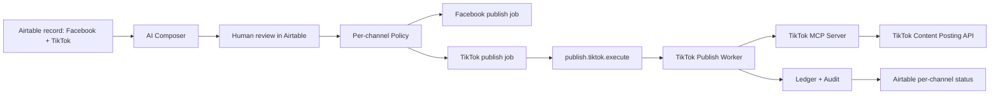

# PLAN-US-017: TikTok Direct Posting MCP

status: approved

## Goal

Implement TikTok Direct Post publishing through a dedicated TikTok MCP layer, supporting both video and photo posts while preserving per-channel publishing and existing MediaOps security boundaries.

## Tasks

- AC-001: Extend Airtable and shared contracts for TikTok platform fields and per-channel status.
- AC-002: Add TikTok channel account setup contracts, OAuth design, and manual seed fallback.
- AC-003: Create TikTok MCP server with OAuth, creator info, direct post, upload, and status tools.
- AC-004: Add TikTok publish queue topology and worker flow.
- AC-005: Extend policy engine for TikTok video/photo rules and US-016 media readiness.
- AC-006: Persist TikTok publish results and status polling results in Ledger.
- AC-007: Update Airtable sync to show TikTok and overall per-channel publish status.
- AC-008: Add tests for contracts, MCP boundary, policy, worker, OAuth fallback, and status polling.
- AC-009: Run runtime smoke against TikTok Direct Post if app approval and scopes are available.

## Done When

- AC-001: One Airtable record can target Facebook and TikTok with independent jobs.
- AC-002: TikTok account connection is available through documented OAuth path or staging manual seed fallback.
- AC-003: TikTok API calls exist only inside `apps/tiktok-mcp-server`.
- AC-004: TikTok queue payloads are reference-only and tenant-scoped.
- AC-005: Mixed TikTok video/photo media fails TikTok only, not Facebook.
- AC-006: TikTok publish and status results are sanitized and persisted.
- AC-007: Airtable shows `tiktok_publish_status` and `overall_publish_status`.
- AC-008: `npm run build`, `npm run lint`, and `npm test` pass.
- AC-009: Runtime smoke either publishes to TikTok or records a platform approval blocker with evidence.

## Current State

The project currently has a Facebook MCP server and Facebook-oriented publish execution. TikTok is mentioned in product vision but has no dedicated MCP server, OAuth setup, policy rules, queues, or worker. US-017 depends on US-016 because TikTok should publish only optimized R2 media derivatives rather than Airtable attachment URLs.

## Architecture

## Platform Output Fields

Airtable fields:

- `tiktok_caption`
- `tiktok_hashtags`
- `tiktok_post_type`
- `tiktok_publish_status`
- `tiktok_external_post_id`
- `overall_publish_status`

AI Composer must generate TikTok copy separately from Facebook copy. TikTok caption must not be derived by truncating Facebook body.

## TikTok Account Setup

Production path:

1. Admin calls `/api/v1/admin/tiktok/auth/start`.
2. Orchestrator creates OAuth state and requests TikTok OAuth URL from TikTok MCP.
3. TikTok redirects to `/api/v1/admin/tiktok/auth/callback`.
4. MCP exchanges code for tokens.
5. Token is stored in secret store.
6. `channel_accounts` stores provider `tiktok`, account metadata, token status, and secret reference.
7. Health check validates account readiness.

Fallback path:

- Script `seed_tiktok_channel_account` can insert staging/demo token references when OAuth or app approval is blocked.
- Reports must label fallback usage as an operational constraint.

## MCP Tools

- `generate_tiktok_oauth_url`
- `exchange_tiktok_code`
- `query_tiktok_creator_info`
- `publish_tiktok_post`
- `get_tiktok_post_status`
- `health_check_tiktok_token`

TikTok MCP resolves raw tokens internally. Orchestrator passes opaque references only.

## Queue Topology

| Queue | Routing Key | DLQ | Retry |
|:---|:---|:---|:---|
| `publish.tiktok.requested` | `publish.tiktok.requested` | `publish.tiktok.requested.dlq` | TTL retry |
| `publish.tiktok.validated` | `publish.tiktok.validated` | `publish.tiktok.validated.dlq` | TTL retry |
| `publish.tiktok.execute` | `publish.tiktok.execute` | `publish.tiktok.execute.dlq` | TTL retry |
| `publish.tiktok.status_check` | `publish.tiktok.status_check` | `publish.tiktok.status_check.dlq` | TTL retry |

## Policy Rules

TikTok video:

- Requires `tiktok_post_type = video` or unambiguous single video.
- Requires exactly one ready US-016 video derivative.
- Blocks if image assets are present for TikTok.

TikTok photo:

- Requires `tiktok_post_type = photo` or unambiguous image-only media.
- Requires 1 to 35 ready US-016 image derivatives.
- Max image size per derivative: 50 MB.
- Blocks if video assets are present for TikTok.

General:

- Missing active TikTok account blocks TikTok only.
- Missing creator info blocks TikTok only.
- TikTok scope or app approval error blocks TikTok only.
- Facebook job must not be rolled back due to TikTok failure.

## Worker Flow

1. Claim TikTok publish job in transaction.
2. Load content variant, media derivatives, channel account, and policy snapshot.
3. Call `query_tiktok_creator_info`.
4. Validate privacy options and account restrictions.
5. Call `publish_tiktok_post`.
6. Persist sanitized publish result.
7. If TikTok returns processing status, enqueue `publish.tiktok.status_check`.
8. Update Airtable TikTok status.
9. ACK after Ledger update.

## Test Matrix

| Area | Test |
|:---|:---|
| Shared contracts | Reject raw tokens, raw platform response, binary payload |
| MCP boundary | No TikTok API calls outside TikTok MCP server |
| OAuth | State validation, callback, manual seed fallback |
| Policy | Video, photo, mixed media, too many photos, missing media |
| Worker | Success, transient retry, permanent failure, async status polling |
| Ledger | Per-channel status, idempotency, RLS |
| Airtable sync | TikTok status and overall partial publish |
| Runtime smoke | R2 media URL to TikTok Direct Post |

## Rollout Plan

1. Implement US-016 first or provide a test fixture with ready media derivatives.
2. Add TikTok contracts and migrations.
3. Add TikTok MCP server scaffold and tools.
4. Add TikTok account setup routes and manual seed script.
5. Add policy and worker flow.
6. Add Airtable status sync.
7. Run local tests with mocked TikTok API.
8. Run staging smoke with real TikTok API if approval and scope are available.

## Production Readiness Checklist

- TikTok app has Content Posting API access.
- Required OAuth scopes are approved.
- OAuth callback URL is configured.
- TikTok account is connected or seed fallback is documented as staging-only.
- US-016 media derivatives are ready and public via R2.
- Status polling proves final TikTok result.
- Build, lint, tests pass.
- Runtime smoke evidence exists.

## Open Items

- Confirm exact TikTok scope set during implementation using current official docs.
- Confirm app review status before claiming production readiness.
- Confirm default privacy option after `query_creator_info` returns account-specific options.
